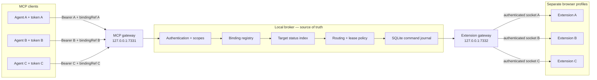

# Octopus Browser Relay

Route MCP browser commands to the correct Chrome profile—without exposing Chrome profile IDs, extension IDs, socket IDs, or other private routing identifiers to agents.

Octopus Browser Relay is a local control plane between MCP clients and browser extensions. Each agent authenticates as its own principal, discovers an opaque `bindingRef`, and includes that reference in every profile-specific call. The broker owns identity, connection state, leases, policy, durable command state, and the final mapping to one authenticated extension instance.

> [!IMPORTANT]
> This repository is an early pre-release (`0.2.0`). The broker, extension, one-agent/one-profile binding contract, automated test suite, and three-profile physical test path are working. A public agent-provisioning command and distributable Native Messaging installer are not yet packaged.

## Why this exists

Running several browser profiles creates an identity problem: an agent needs to say “use my browser” without knowing a raw profile ID or accidentally reaching another agent's profile.

This project solves that with broker-owned bindings:

- one Chrome or AdsPower profile runs one extension instance;
- one MCP client authenticates as one agent principal;
- an administrator pairs the extension and binds the principal to it;
- the agent receives only an opaque `bindingRef`;
- every routed call is validated against both the bearer token and `bindingRef`;
- the broker privately resolves the binding to the current authenticated extension socket.

The architecture keeps relationship cardinality in the broker rather than the extension transport, so other sharing policies can be added later. The current `v2` MCP contract intentionally enforces one active agent-to-extension binding on both sides because it gives the clearest isolation boundary for parallel Codex tasks.

## Architecture



The browser reports facts such as connected, available, busy, offline, or error. Those facts are not routing decisions. The broker combines current status with authorization, binding ownership, lease state, deadlines, retry rules, and command semantics to decide whether to deliver, queue, wait, or reject.

For the full interactive system map, open [`outputs/profile-aware-browser-relay/index.html`](./outputs/profile-aware-browser-relay/index.html).

## Core properties

- **Profile-safe routing:** a foreign `bindingRef` fails even when it is structurally valid.
- **Private internal identity:** MCP responses omit target IDs, socket IDs, profile paths, keys, hashes, and connection epochs.
- **Broker-owned truth:** SQLite stores targets, bindings, leases, commands, results, and audit events.
- **Durable dispatch:** commands are committed before delivery and serialized per target.
- **Explicit ambiguity:** non-idempotent work with an uncertain result becomes `UNKNOWN_OUTCOME`; it is never silently replayed.
- **Reconnect fencing:** a newer authenticated extension epoch replaces an older socket.
- **Service-worker tolerance:** reconnect alarms, heartbeats, and durable broker state do not assume a permanently awake Manifest V3 worker.
- **Loopback-first security:** the MCP and WebSocket listeners reject non-local hosts by default.
- **Chrome and AdsPower transport:** the extension supports a Native Messaging companion, with direct WebSocket retained for diagnostics.

## Project status

| Area | State |
| --- | --- |
| Broker, SQLite migrations, MCP gateway | Implemented |
| Manifest V3 extension | Implemented |
| Exclusive agent-to-extension `bindingRef` contract | Implemented |
| Unit, contract, integration, fault, and N:N E2E tests | Passing |
| Live three-profile A/B/C routing and isolation | Passed |
| Long-duration physical recovery soak | Pending release gate |
| Public agent credential CLI | Not yet packaged |
| Native companion installer/uninstaller | Not yet committed |
| Open-source license | MIT |

## Requirements

- Windows 10 or newer for the current native companion build
- Node.js `22.12.0` or newer
- pnpm `11.19.0` or compatible pnpm 11 release
- Chrome/Chromium `116` or newer
- Visual Studio C++ Build Tools with the x64 toolchain when building the native companion

The TypeScript broker and direct WebSocket path are platform-neutral, but the current native companion build and registration flow are Windows-specific.

## Development quick start

After cloning the repository:

```powershell
cd octopus-browser-relay
corepack enable
pnpm install --frozen-lockfile
pnpm verify
pnpm dev
```

Default local endpoints and storage:

| Purpose | Default |
| --- | --- |
| MCP | `http://127.0.0.1:7331/mcp` |
| Health | `http://127.0.0.1:7331/health` |
| Extension relay | `ws://127.0.0.1:7332/relay` |
| SQLite database | `.relay-data/relay.sqlite` |
| Generated admin token | `.relay-data/admin-token.txt` |

The admin token is generated on first start when `RELAY_ADMIN_TOKEN` is unset. `.relay-data/` is ignored by Git; do not commit or paste its contents.

To build without starting the development server:

```powershell
pnpm build
pnpm start
```

### Load the extension

1. Build the project with `pnpm build:extension` or `pnpm verify`.
2. Open `chrome://extensions` in each browser profile.
3. Enable **Developer mode**.
4. Choose **Load unpacked** and select `apps/extension/dist`.
5. Open **Browser Relay Settings** from that profile's extension instance.

For a first diagnostic connection in regular Chrome, select **Direct WebSocket** and use `ws://127.0.0.1:7332/relay`. Chrome may ask for Local Network Access; allow access to loopback.

AdsPower should use **Native companion (recommended)** because some AdsPower kernels block extension-initiated loopback WebSockets even when their website allowlist is enabled. The native executable builds to `dist/apps/native-host/relay-native-host.exe`; a public install/uninstall script and Native Messaging host manifest are still release prerequisites.

## Pair and bind a profile

Provisioning has two different authorities:

- the **administrator** pairs, names, binds, renames, and revokes targets;
- the **agent** can discover and use only its own active binding.

The intended flow is:

1. Provision a unique bearer credential for the MCP agent.
2. Using the admin credential, call `pair_target` with a safe alias such as `profile-a`.
3. Enter the returned one-time eight-character code in that profile's extension options.
4. Call `bind_agent` with the agent's `principalId` and the target alias.
5. The agent calls `get_my_binding` and retains the returned opaque `bindingRef`.
6. The agent attaches that `bindingRef` to every target-specific MCP call.

```json
{
  "bindingRef": "br_example_opaque_reference",
  "operation": "list_tabs",
  "parameters": {},
  "idempotencyClass": "read",
  "deadlineMs": 30000
}
```

`bindingRef` is a routing reference, not a secret. The bearer token authenticates the agent; the broker requires the binding row to match that authenticated principal before it resolves the private target.

The repository currently provisions non-admin principals through its storage API and real-world test harness. A supported `create-agent` CLI is required before public users can complete this flow without development code.

## Connect an MCP client

Configure one MCP connection per agent:

- URL: `http://127.0.0.1:7331/mcp`
- transport: Streamable HTTP
- header: `Authorization: Bearer <agent-token>`

Do not share one bearer token among independent agents. Separate credentials are what let the broker prove that `bindingRef A` belongs to Agent A and reject Agent B's attempt to use it.

### MCP tools

| Group | Tools |
| --- | --- |
| Agent discovery | `list_targets`, `get_my_binding`, `get_target` |
| Sessions | `acquire_session`, `release_session` |
| Browser work | `dispatch`, `get_command` |
| Administration | `pair_target`, `bind_agent`, `unbind_agent`, `list_bindings`, `rename_target`, `revoke_target`, `broker_health` |

`get_target`, `acquire_session`, `release_session`, `dispatch`, and `get_command` require an owned `bindingRef`. Mutating browser operations also require a valid session lease.

Supported browser operations are:

- `list_tabs`
- `get_active_tab`
- `open_url`
- `activate_tab`
- `navigate`
- `snapshot`

See [the MCP binding contract](./docs/mcp-contract-v2.md) and [the extension relay protocol](./docs/protocol-v1.md) for the wire-level rules.

## Configuration

Copy [`.env.example`](./.env.example) into your preferred local environment loader or set variables before starting the broker.

| Variable | Default | Purpose |
| --- | --- | --- |
| `RELAY_HOST` | `127.0.0.1` | Listener address |
| `RELAY_MCP_PORT` | `7331` | MCP and health HTTP port |
| `RELAY_WS_PORT` | `7332` | Extension WebSocket port |
| `RELAY_DB_PATH` | `.relay-data/relay.sqlite` | Durable broker database |
| `RELAY_LOG_LEVEL` | `info` | Pino log level |
| `RELAY_HEARTBEAT_TIMEOUT_MS` | `45000` | Extension liveness timeout |
| `RELAY_ERROR_THRESHOLD` | `3` | Consecutive error threshold |
| `RELAY_LEASE_TTL_MS` | `60000` | Default exclusive lease lifetime |
| `RELAY_ADMIN_TOKEN` | generated locally | Administrative bearer token |

Changing `RELAY_HOST` away from loopback is outside the current threat model. Do not expose either listener to a LAN or the internet without TLS, explicit host/origin allowlists, stronger secret storage, and a separate security review.

## Verification

```powershell
pnpm lint
pnpm typecheck
pnpm test
pnpm test:e2e
pnpm build
```

Or run the complete gate:

```powershell
pnpm verify
pnpm smoke
```

`pnpm verify` covers schema contracts, authorization, SQLite migrations, status derivation, routing policy, binding isolation, lease handling, reconnect fencing, serialization, crash recovery, MCP transport, WebSocket behavior, extension packaging, native compilation, and a multi-agent/multi-extension E2E scenario.

The physical qualification uses three separate browser profiles and three independently authenticated Codex tasks. See [the real-world test runbook](./docs/real-world-test-runbook.md).

## Repository layout

```text
apps/
  broker/             Local broker process
  extension/          Manifest V3 Chrome extension
  native-host/        Windows Native Messaging companion
packages/
  broker-core/        Status, policy, leases, and durable dispatch
  extension-gateway/  Authenticated WebSocket gateway
  mcp-gateway/        MCP authentication and tool surface
  protocol/           Schemas and versioned message contracts
  storage/            SQLite repositories and migrations
docs/                 Protocol, security, and test documentation
scripts/              Build, smoke, and real-world test automation
tests/                Unit, contract, integration, fault, E2E, and physical tests
```

## Security model

- Agent tokens, pairing codes, and session handles are stored as hashes.
- Pairing codes are short-lived and one-use.
- Each extension creates an ECDSA P-256 identity and signs reconnect challenges.
- Target IDs and live connection identifiers remain inside the broker.
- MCP outputs use explicit allowlists rather than serializing storage rows.
- Authorization headers and credential material are redacted from logs.
- Only allowlisted browser operations and validated parameters are accepted.

Read [the security model](./docs/security.md) and [security reporting policy](./SECURITY.md) before changing listener scope, identity, pairing, routing, or replay behavior. Please do not include tokens, pairing codes, local profile paths, or private target identifiers in public bug reports.

## Contributing

Contributions are welcome. Read [CONTRIBUTING.md](./CONTRIBUTING.md), use `pnpm verify` as the required local gate, and keep changes within the existing trust boundaries:

- MCP identifies the agent and carries opaque routing references.
- The broker is the only source of truth and the only component that chooses a target socket.
- The extension reports facts and executes validated commands; it does not make broker routing decisions.
- Raw browser-profile identity never crosses the public MCP boundary.

## License

Octopus Browser Relay is available under the [MIT License](./LICENSE).
