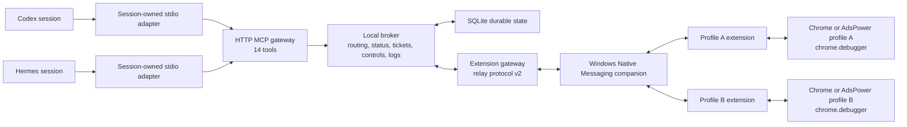

# Octopus Browser Relay

Give AI-agent sessions brokered, profile-aware access to multiple local Chrome or AdsPower browsers through MCP.

Octopus Browser Relay connects a local MCP gateway to one extension instance in each browser profile. An agent asks for browser capacity, receives broker-issued workspace and tab references, submits extension-supported Chrome DevTools Protocol (CDP) commands, and polls durable request tickets. The extension relays those commands through `chrome.debugger`; Chrome does not need a public remote-debugging port.

> [!IMPORTANT]
> Version `0.3.0` is a development release. The canonical fourteen-tool runtime, relay-v2 protocol, Native Messaging path, and extension-backed CDP adapter are implemented in this repository. Automated verification and physical Chrome, AdsPower, Codex, and Hermes qualification are separate gates; see [Current limits](#current-limits) and the [real-world runbook](./doc/06-Files/Real-World-Runbook.md).

## What agents can do

- discover connected browser-profile endpoints and broker-issued window choices;
- request one or more workspaces on distinct profiles;
- receive an initial managed tab and CDP event cursor for each workspace;
- create additional managed tabs;
- send raw CDP commands from the extension-supported capability manifest;
- poll asynchronous request tickets and read retained CDP events;
- transfer, pause, resume, terminate, or recover workspace control; and
- pause or resume every owned workspace on one endpoint.

The broker keeps the relationship among agent sessions, endpoints, windows, workspaces, tabs, tickets, and live extension connections. Agent-facing calls use broker-issued references and endpoint nicknames instead of Chrome profile IDs, extension IDs, window IDs, tab IDs, socket IDs, or debug ports.

## Architecture



Normal installed profiles use the Native Messaging companion. The companion forwards extension messages to the broker's loopback relay. Direct extension-to-WebSocket transport remains available only for diagnostics.

Read the canonical [Product definition](./doc/01-Product/Product-Definition.md), [MCP contract](./doc/03-User-Interface/MCP-Contract.md), [System architecture](./doc/04-System/System-Architecture.md), and [Component architecture](./doc/05-Components/Component-Architecture.md) for the complete design.

## Requirements

- Windows with PowerShell, current-user Native Messaging registry access, and WinHTTP WebSocket support for the checked-in native host and installer;
- Node.js `22.12.0` or newer;
- pnpm `11.19.0` or another compatible pnpm 11 release;
- Chrome, Chromium, or an AdsPower browser kernel compatible with Manifest V3 and Chrome `116` or newer; and
- Visual Studio C++ Build Tools with an x64 compiler and Windows SDK when rebuilding the native companion.

The TypeScript broker is not intrinsically tied to Windows, but the current native companion uses WinHTTP and the current registration script writes Windows registry keys.

## Installation

### The installer builds, registers, and prepares the local runtime

From the repository root, run:

```powershell
corepack enable
pwsh -NoProfile -File .\tools\install-local.ps1 -Install -StartBroker
```

The installer runs the frozen pnpm install and build unless skip switches are supplied, verifies the compiled stdio MCP adapter, registers `io.github.ohmyskyhigh.octopus_browser_relay` for the current Windows user under Google Chrome, Chromium, and the installed AdsPower/SunBrowser registry roots, migrates an attributable prototype registration, optionally starts the compiled broker, and creates these local handoff files:

```text
.relay-data/bootstrap/PAIRING.md
.relay-data/bootstrap/MCP-REGISTRATION.md
.relay-data/bootstrap/codex-mcp.toml
.relay-data/bootstrap/hermes-mcp.txt
```

It does not overwrite Codex or Hermes configuration. It also leaves browser-profile data and existing broker state in place.

### Preflight reports each missing setup action as JSON

With the broker running, execute either readiness entry point:

```powershell
pwsh -NoProfile -File .\tools\install-local.ps1
```

```powershell
pwsh -NoProfile -File .\tools\real-world-preflight.ps1
```

The check verifies the workspace, built extension files, required manifest declarations, native executable, compiled stdio adapter, Native Messaging manifest, every configured Native Messaging registry value, generated pairing and MCP handoff files, and both health endpoints. It exits with code `10` when operator action is still required. Pass the same `-NativeRegistryRoots` values to installation and preflight when a browser build uses different roots.

### The stop command refuses to terminate an unrelated process

An installer-started broker records its process ID in `.relay-data/broker.pid`. Stop it with:

```powershell
pwsh -NoProfile -File .\tools\stop-local-broker.ps1
```

The command inspects the recorded Windows process and stops it only when it is `node.exe` running this workspace's absolute compiled broker entry point. A missing PID file is a successful no-op; a stale PID is retained for inspection; a process mismatch is rejected without stopping anything or deleting the PID file. Use `Ctrl+C` for a foreground `pnpm dev` broker.

### Development mode runs the broker directly from TypeScript

After the one-time Native Messaging registration, use this shorter development loop:

```powershell
corepack enable
pnpm install --frozen-lockfile
pnpm build:extension
pnpm dev
```

`pnpm dev` runs `apps/broker/src/runtime/main.ts` through `tsx`. Rebuild and reload `dist/browser-extension` after extension source changes.

## Browser profile pairing

### Every browser profile loads and pairs its own extension instance automatically

Repeat these steps inside each Chrome or AdsPower profile that the broker should control:

1. Open `chrome://extensions`.
2. Enable **Developer mode**.
3. Choose **Load unpacked** and select `dist/browser-extension`.
4. Confirm the extension ID is `caekiojlchhifdomfghejkbfpmaklafe`.
5. Open **Octopus Browser Relay Settings**. The extension displays its two-word profile-local pairing code and compact combined nickname, such as `MINT-WAVE` and `mintwave`.
6. Keep **Native companion** selected and choose **Save connection settings** if you changed the transport or relay URL.
7. Wait until the extension reports `Status: connected` with the final endpoint nickname.

The extension generates the readable code and registers itself with the running loopback broker; there is no broker-code command and no code-entry field. A nickname collision makes the unpaired extension choose another pair of words and retry automatically. The readable code helps correlate this profile with its endpoint and is not an authorization secret. Reconnect authentication uses the profile's persisted cryptographic identity. Repeat the load-and-connect steps in every participating profile.

### Direct WebSocket stays available for explicit diagnostics

The extension options page can connect directly to `ws://127.0.0.1:7332/relay`, but that mode is not the normal Chrome or AdsPower setup. Browser kernels can block extension-initiated loopback WebSockets even when ordinary page requests to `127.0.0.1` work. Use **Native companion** for installed profiles and switch to direct WebSocket only while diagnosing transport behavior.

## Agent registration

### The installer generates a Codex stdio MCP configuration fragment

Merge `.relay-data/bootstrap/codex-mcp.toml` into the active Codex `config.toml`, then start a new Codex session. The generated fragment launches Node with `dist/mcp-stdio-adapter/src/main.js` and passes the broker URL, token-file path, and `codex` runtime label as process environment.

The token remains in `.relay-data/admin-token.txt`; the generated fragment points to that file instead of embedding the token. The repository does not choose or modify the active Codex configuration file.

### The installer generates Hermes registration guidance for the installed CLI

Open `.relay-data/bootstrap/MCP-REGISTRATION.md` and run the exact stdio command stored in `.relay-data/bootstrap/hermes-mcp.txt`. It launches the same compiled adapter with `OCTOPUS_RUNTIME=hermes`, the broker URL, and the local token-file path. Then run:

```powershell
hermes mcp test octopus-browser-relay
```

Hermes CLI releases can change their configuration syntax. The current repository generates the command and readiness handoff but does not install Hermes or prove a particular external Hermes release.

### One stdio adapter process supplies caller evidence for one agent session

The adapter prefers runtime-owned environment values in this order:

- `CODEX_THREAD_ID`;
- `CODEX_SESSION_ID`;
- `HERMES_SESSION_ID`; and
- `HERMES_AGENT_SESSION_ID`.

`OCTOPUS_RUNTIME_SESSION` can supply an explicit fallback. When none exists, the adapter generates one random session key at startup and retains it for that process. Parent-session variants are forwarded for related subagents.

The adapter forwards these facts to the HTTP broker as `x-octopus-runtime`, `x-octopus-runtime-session`, and optional `x-octopus-parent-runtime-session` headers. They are adapter-supplied evidence, not values for the model to invent or include in tool bodies.

## MCP tools

### Fourteen tools cover discovery, browser work, monitoring, recovery, and control

| Execution | Tool | Purpose |
| --- | --- | --- |
| Read | `get_browser_context` | Read one narrow, paginated broker, endpoint, window, capability, workspace, tab, or request-summary view. |
| Async | `request_browser_workspace` | Request an exact number of workspaces on distinct eligible profile endpoints. |
| Async | `create_browser_tab` | Create one managed tab in an owned workspace. |
| Async | `send_cdp_command` | Submit one supported raw CDP command to one managed tab. |
| Read | `read_cdp_events` | Read retained CDP events from a broker-issued tab cursor. |
| Read | `get_browser_request` | Read one visible request ticket. |
| Async | `take_over_workspace` | Transfer one exactly identified workspace. |
| Async | `terminate_workspace` | Reconcile running work, archive the tab group, and end the workspace. |
| Async | `resolve_browser_request` | Resolve one owner-visible request paused for confirmation. |
| Immediate | `close_browser_request` | Remove one terminal ticket from public discovery while retaining audit history. |
| Async | `stop_workspace_automation` | Pause one workspace manually. |
| Async | `resume_workspace_automation` | Reconcile and clear the workspace's manual-stop cause. |
| Async | `kill_browser_endpoint` | Pause every active workspace on one entirely owned endpoint. |
| Async | `resume_browser_endpoint` | Reconcile the endpoint and clear its endpoint-kill cause. |

Every asynchronous tool returns an accepted `request_ref` before its browser effect becomes eligible for dispatch. The agent polls that reference with `get_browser_request`. The exact request and result schemas live in [MCP-Contract.schema.json](./doc/03-User-Interface/MCP-Contract.schema.json).

The current extension capability baseline is [extension-baseline.json](./apps/shared/protocol/capabilities/extension-baseline.json). It includes selected Accessibility, DOM, Emulation, Input, Network, Page, and Runtime methods, all confined to a managed tab.

## Local endpoints and state

| Purpose | Default |
| --- | --- |
| MCP and MCP health | `http://127.0.0.1:7331/mcp` and `http://127.0.0.1:7331/health` |
| Extension relay and relay health | `ws://127.0.0.1:7332/relay` and `http://127.0.0.1:7332/health` |
| SQLite state | `.relay-data/relay.sqlite` |
| Generated bearer token | `.relay-data/admin-token.txt` |
| Installer-managed broker PID | `.relay-data/broker.pid` |
| Generated setup handoff | `.relay-data/bootstrap/` |

The broker creates the token on first start when `RELAY_ADMIN_TOKEN` is unset. `.relay-data/` is ignored by Git.

Supported environment variables are `RELAY_HOST`, `RELAY_MCP_PORT`, `RELAY_WS_PORT`, `RELAY_DB_PATH`, `RELAY_LOG_LEVEL`, `RELAY_HEARTBEAT_TIMEOUT_MS`, `RELAY_ERROR_THRESHOLD`, `RELAY_LEASE_TTL_MS`, and `RELAY_ADMIN_TOKEN`. Their validated defaults are defined in `apps/broker/src/runtime/config.ts`.

## Verification

### Automated checks exercise contracts, storage, gateways, broker policy, and packaging

```powershell
pnpm lint
pnpm typecheck
pnpm test
pnpm test:e2e
pnpm build
```

`pnpm verify` runs those checks as one gate. `pnpm build` also compiles the Windows native companion and therefore needs the C++ toolchain. Use the [real-world runbook](./doc/06-Files/Real-World-Runbook.md) for physical profiles and agent runtimes.

## Current limits

- The Native Messaging host and registration installer are Windows-specific.
- The installer registers current-user host manifests for Google Chrome, Chromium, and the installed AdsPower/SunBrowser root. Another browser build or AdsPower variant that reads a different registry location needs its actual root passed through `-NativeRegistryRoots`.
- The installer generates Codex and Hermes stdio handoff files but does not modify either runtime's configuration or install either runtime.
- Independent sessions remain distinct when the host launches one adapter process per session or supplies a supported runtime session environment value. A host that deliberately reuses one adapter process across unidentified sessions also reuses that adapter identity.
- The HTTP broker confirms an accepted ticket after handing it to the stdio adapter. MCP has no transaction spanning that HTTP handoff and the adapter's later stdout write, so an adapter crash in that narrow interval can dispatch work whose ticket the agent runtime did not receive.
- The extension executes only methods published by `octopus-extension-baseline-v1`; flattened child CDP sessions are disabled.
- Relay-v2 extension envelopes are limited to 1 MiB. Capability and inventory limits are published in the same manifest.
- The relay-v1 compatibility bridge remains enabled for migration, while the public MCP gateway exposes only the canonical fourteen tools.
- The repository does not install Codex, Hermes, Chrome, or AdsPower, and it has not yet recorded the final cross-runtime, multi-profile physical qualification for this release.
- There is a PID-verified broker stop command but no full uninstall command yet.

## Repository layout

```text
doc/                    Top-down knowledge vault and change governance
apps/broker/            Broker runtime, core, MCP, relay, and storage source
apps/browser-extension/ Manifest V3 extension source
apps/mcp-stdio-adapter/ Session-owned stdio bridge for Codex and Hermes
apps/native-host/       Windows Native Messaging companion source
apps/shared/protocol/   MCP schemas, relay schemas, domain facts, and capabilities
tools/                  Build, install, pairing, preflight, and test automation
tests/                  Contract, unit, integration, fault, E2E, and physical tests
dist/                   Generated broker, adapter, extension, and native artifacts
```

Start with the [top-down vault map](./doc/TOP-DOWN-MOC.md) for project knowledge and the [repository map](./doc/06-Files/Repository-Map.md) for exact implementation paths.

## Contributing

Read [CONTRIBUTING.md](./CONTRIBUTING.md), the vault [editing rules](./doc/AGENTS.md), and [SECURITY.md](./SECURITY.md) before changing contracts, routing, transport, listener scope, or identity behavior. Do not include bearer tokens, pairing codes, private browser identifiers, profile paths, or SQLite files in public reports.

## License

Octopus Browser Relay is available under the [MIT License](./LICENSE).
