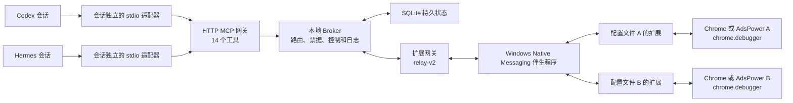

# Octopus Browser Relay

[English](./README.md) | [简体中文](./README.zh-CN.md) | [中文文档](./doc/zh-CN/README.md)

Octopus Browser Relay 通过 MCP，让 Codex、Hermes 等 AI Agent 会话以可审计、按浏览器配置文件隔离的方式控制本机多个 Chrome 或 AdsPower 浏览器。

每个浏览器配置文件安装一个扩展实例。Agent 向本地 Broker 申请工作区，获得 Broker 签发的 `workspace_ref`、`tab_ref` 和请求票据，再通过扩展支持的 Chrome DevTools Protocol（CDP）子集执行浏览器操作。扩展使用 `chrome.debugger`，不需要开放 Chrome 远程调试端口。

> [!IMPORTANT]
> `0.3.0` 是开发版。14 个 MCP 工具、relay-v2、Native Messaging、扩展 CDP 适配器、Windows 安装与更新流程已经实现并通过自动化及本机多配置文件验证。不同机器仍需完成自己的预检和真实浏览器测试。

## 快速开始

### GitHub Release 更新器是普通用户最短的安装路径

1. 在 Windows 安装 Node.js `22.12.0` 或更高版本。
2. 运行下方的 GitHub Release 更新器。
3. 确认最终 JSON 中 `status` 为 `UPDATED`，`broker.health.status` 为 `ok`，版本为 `0.3.0`。
4. 在每个 Chrome 或 AdsPower 配置文件中打开 `chrome://extensions`，开启**开发者模式**，点击**加载已解压的扩展程序**，选择更新器返回的 `extensionPath`。
5. 打开扩展的 **Octopus Browser Relay Settings**，等待 `Status: connected`。不需要输入配对码；扩展会自动生成两词代码和简短昵称并注册。
6. 打开 `%LOCALAPPDATA%\Octopus Browser Relay\bootstrap\INSTALLATION.md`，按其中内容配置 Codex 或 Hermes，然后新建 Agent 会话。
7. 打开 `http://127.0.0.1:7331/health`。`connectedEndpoints` 应等于准备使用的浏览器配置文件数量。

完整中文步骤见[安装与设置](./doc/zh-CN/Installation-and-Setup.md)。

## 功能

### Agent 使用 Broker 签发的引用操作多个独立浏览器配置文件

- 发现已连接的浏览器端点和可选窗口；
- 在不同配置文件上申请一个或多个工作区；
- 为每个工作区获得初始托管标签页和 CDP 事件游标；
- 创建额外托管标签页；
- 发送扩展能力清单允许的原始 CDP 命令；
- 轮询异步请求票据并读取保留的 CDP 事件；
- 接管、暂停、恢复、终止或人工确认工作区任务；
- 暂停或恢复同一端点上由当前调用者完整拥有的所有工作区。

Agent 不接触 Chrome 配置文件 ID、扩展 ID、窗口 ID、标签页 ID、Socket ID 或调试端口。公开接口只接受端点昵称以及 Broker 签发的引用。

## 系统结构

### 本地 Broker 连接 Agent、持久状态、扩展网关和每个浏览器配置文件



已安装配置文件的正常连接方式是 Native Messaging。扩展直连 WebSocket 只用于诊断。中文架构与工具说明见[架构与 MCP](./doc/zh-CN/Architecture-and-MCP.md)。

## 环境要求

### 当前安装和 Native Messaging 流程以 Windows 为目标平台

- Windows、PowerShell 和当前用户注册表写入权限；
- Node.js `22.12.0` 或更高版本；
- GitHub Release 安装不要求 pnpm；从源码构建需要 pnpm `11.19.0` 或兼容的 pnpm 11；
- Chrome、Chromium 或支持 Manifest V3、Chrome `116+` 的 AdsPower 内核；
- 只有从源码重编译 Native Messaging 伴生程序时，才需要 Visual Studio C++ Build Tools、x64 编译器和 Windows SDK。

## Release 安装

### 独立更新器会校验、安装、注册并启动选定版本

在 PowerShell 中执行：

```powershell
Invoke-WebRequest `
  https://github.com/ohmyskyhigh/octopus-browser-relay/releases/latest/download/octopus-browser-relay-update.ps1 `
  -OutFile .\octopus-browser-relay-update.ps1
pwsh -NoProfile -File .\octopus-browser-relay-update.ps1
```

更新器会：

- 下载 Windows ZIP 和 SHA-256 文件；
- 校验 ZIP 哈希和包内每个文件的哈希及大小；
- 安装到 `%LOCALAPPDATA%\Octopus Browser Relay\releases\<version>`；
- 将扩展同步到稳定目录 `%LOCALAPPDATA%\Octopus Browser Relay\browser-extension`；
- 注册版本化 Native Messaging 伴生程序；
- 保留 `data` 目录中的 SQLite、令牌、配对和审计状态；
- 生成 Codex 与 Hermes 配置交接文件；
- 启动 Broker，并确认健康接口报告目标版本；
- 在启动失败时恢复上一个版本。

生成的主要文件位于：

```text
%LOCALAPPDATA%\Octopus Browser Relay\bootstrap\INSTALLATION.md
%LOCALAPPDATA%\Octopus Browser Relay\bootstrap\codex-mcp.toml
%LOCALAPPDATA%\Octopus Browser Relay\bootstrap\hermes-mcp.txt
%LOCALAPPDATA%\Octopus Browser Relay\bootstrap\current-release.json
```

ZIP 本身不能直接作为 Chrome 扩展加载。必须先运行更新器，再选择它返回的稳定扩展目录。

## 浏览器扩展

### 每个浏览器配置文件只需从稳定目录加载一次扩展

在每个需要控制的 Chrome 或 AdsPower 配置文件中：

1. 打开 `chrome://extensions`。
2. 开启**开发者模式**。
3. 点击**加载已解压的扩展程序**。
4. 选择 `%LOCALAPPDATA%\Octopus Browser Relay\browser-extension`。
5. 确认扩展 ID 为 `caekiojlchhifdomfghejkbfpmaklafe`。
6. 打开扩展设置页，保持 **Native companion**，等待连接成功。

每个配置文件拥有独立扩展存储、密钥、两词配对代码和简短昵称。昵称冲突时，未配对扩展会自动换一组词并重试。两词代码用于人类识别配置文件，不是授权密钥。

### 后续更新会复用同一路径并请求一次受控扩展重载

运行已安装的更新器：

```powershell
pwsh -NoProfile -File "$env:LOCALAPPDATA\Octopus Browser Relay\update-local.ps1"
```

更新器替换稳定目录中的文件。新 Broker 发现扩展版本不匹配时，会要求扩展执行一次 `chrome.runtime.reload()`。扩展保留配置文件内的配对身份并重新连接。若重载后仍不匹配，扩展会报告错误，而不会无限循环重载。

## Agent 配置

### Codex 使用更新器生成的 TOML 片段启动会话独立适配器

将 `bootstrap\codex-mcp.toml` 合并到当前 Codex `config.toml`，然后新建 Codex 会话。配置通过本地文件引用令牌，不会把令牌内容写进 TOML。

### Hermes 使用更新器生成的命令注册同一个 stdio MCP 服务

执行 `bootstrap\hermes-mcp.txt` 中的完整命令，然后验证：

```powershell
hermes mcp test octopus-browser-relay
```

必须发现 14 个工具。Codex 和 Hermes 都应为每个独立 Agent 会话启动独立的 stdio 适配器进程，以保持会话身份隔离。

## 源码安装

### 开发者可以从仓库构建、注册并启动本地运行时

```powershell
git clone https://github.com/ohmyskyhigh/octopus-browser-relay.git
Set-Location .\octopus-browser-relay
corepack enable
pnpm install --frozen-lockfile
pwsh -NoProfile -File .\tools\install-local.ps1 -Install -StartBroker
```

源码安装把生成状态写到 `.relay-data`，扩展构建输出为 `dist\browser-extension`。开发时可以运行：

```powershell
pnpm build:extension
pnpm dev
```

扩展源码变化后，需要重新构建并在浏览器扩展页重载 `dist\browser-extension`。

## MCP 工具

### 14 个工具覆盖发现、浏览器工作、监控、恢复和控制

| 类型 | 工具 |
| --- | --- |
| 读取 | `get_browser_context` |
| 异步 | `request_browser_workspace` |
| 异步 | `create_browser_tab` |
| 异步 | `send_cdp_command` |
| 读取 | `read_cdp_events` |
| 读取 | `get_browser_request` |
| 异步 | `take_over_workspace` |
| 异步 | `terminate_workspace` |
| 异步 | `resolve_browser_request` |
| 立即 | `close_browser_request` |
| 异步 | `stop_workspace_automation` |
| 异步 | `resume_workspace_automation` |
| 异步 | `kill_browser_endpoint` |
| 异步 | `resume_browser_endpoint` |

所有异步工具都会先返回 Broker 签发的 `request_ref`，Agent 再用 `get_browser_request` 读取状态和结果。精确输入输出结构以英文规范 [MCP-Contract.schema.json](./doc/03-User-Interface/MCP-Contract.schema.json) 为准。

## 验证

### 完整源码门禁覆盖静态检查、测试、E2E 和所有构建目标

```powershell
pnpm verify
```

也可以分别运行：

```powershell
pnpm lint
pnpm typecheck
pnpm test
pnpm test:e2e
pnpm build
```

健康接口：

```text
http://127.0.0.1:7331/health
http://127.0.0.1:7332/health
```

## 故障排查

### 扩展未连接时应从 Broker 健康、Native Messaging 和扩展路径依次检查

1. 确认两个健康接口可访问。
2. 确认扩展 ID 和稳定扩展目录正确。
3. 确认扩展使用 **Native companion**。
4. 重新运行更新器以修复已安装文件和 Native Messaging 注册。
5. 只重载扩展一次；如果仍显示版本错误，先修复安装，不要反复重载。

### Agent 看不到 14 个工具时应重新创建适配器和 Agent 会话

确认 Codex 或 Hermes 配置指向生成的稳定适配器入口和令牌文件。修改 MCP 配置后必须新建会话。Agent 连接的是 stdio 适配器和 HTTP MCP 网关，不是 `7332` 的 WebSocket relay。

### 停止 Broker 时必须使用带 PID 和命令行校验的脚本

Release 安装：

```powershell
pwsh -NoProfile -File "$env:LOCALAPPDATA\Octopus Browser Relay\stop-installed-broker.ps1"
```

源码安装：

```powershell
pwsh -NoProfile -File .\tools\stop-local-broker.ps1
```

脚本只会停止命令行与已记录入口完全匹配的 Node 进程，不会按端口盲目结束其他进程。

## 当前限制

### 公开版本仍保留明确的开发边界

- Native Messaging 伴生程序和注册脚本目前仅支持 Windows。
- Release 安装不会安装 Codex、Hermes、Chrome 或 AdsPower。
- 扩展只执行 `octopus-extension-baseline-v1` 允许的方法。
- relay-v2 扩展消息上限为 1 MiB。
- relay-v1 兼容桥仍保留用于迁移，但公开 MCP 只暴露 14 个正式工具。
- 当前有 PID 校验的停止命令，但还没有完整卸载命令。

## 仓库结构

### 应用、协议、工具、测试和知识库各自拥有独立目录

```text
apps/broker/            Broker、MCP、relay 和存储
apps/browser-extension/ Manifest V3 扩展
apps/mcp-stdio-adapter/ Codex/Hermes 会话独立适配器
apps/native-host/       Windows Native Messaging 伴生程序
apps/shared/protocol/   MCP、relay、领域事实和能力清单
doc/                    自上而下的项目知识库
tools/                  构建、安装、更新、预检和发布工具
tests/                  合同、单元、集成、故障、E2E 和真实测试
dist/                   生成的构建输出
```

## 文档权威

### 中文资料帮助安装和理解，但英文规范仍是唯一可编辑权威

中文入口见[中文文档](./doc/zh-CN/README.md)。产品、用户体验、MCP、系统、组件和文件结构的规范性定义以英文知识库 [TOP-DOWN-MOC.md](./doc/TOP-DOWN-MOC.md) 为准。若翻译与英文规范不一致，应以英文规范为准并修复翻译。

## 许可证

### 项目使用 MIT License

参见 [LICENSE](./LICENSE)。
