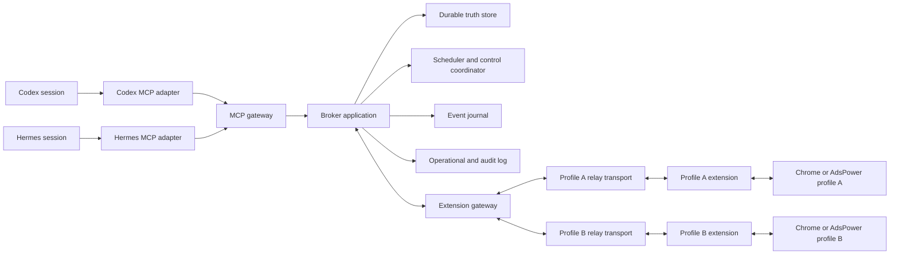

# System architecture

Status: canonical implementation baseline.

This architecture realizes the confirmed Product, User Experience, and MCP contract. Runtime testing may tune advertised numeric limits, worker counts, polling guidance, version allowlists, and adapter workarounds, but must not change public identity, ownership, managed-tab confinement, ticket-before-dispatch, full-cycle same-tab ordering, or control semantics without an upstream proposal.

## System boundary

### The local broker is the sole authority for logical browser automation

Agents call one MCP boundary. The broker owns endpoint registration, caller and lineage resolution, logical windows, workspaces, managed tabs, request tickets, routing, status, scheduling, event cursors, recovery decisions, and logs.

Each browser profile installs one extension instance. On first connection the instance presents its randomly generated two-word pairing code, the compact lowercase nickname formed from those words, and its cryptographic profile identity; the loopback broker registers it automatically as one uniquely named endpoint. A nickname collision returns a retryable relay error, after which the still-unpaired extension selects another two-word label and reconnects without changing its cryptographic identity. The code is a correlation label rather than an authentication secret. Later connections prove the persisted profile identity through broker challenge authentication. The paired extension executes the broker's extension-supported CDP subset through `chrome.debugger`. Neither agent nor extension assigns logical ownership or selects a private Chrome target directly.

### Public references are separated from replaceable browser locators

The broker issues `session_ref`, `lineage_ref`, `window_ref`, `workspace_ref`, `tab_ref`, `request_ref`, and cursors. Private Chrome window, tab, group, target, debugger, child-session, connection, and message identifiers remain behind the broker boundary.

Every public managed-tab command carries `workspace_ref` and `tab_ref`. Browser-issued CDP handles may appear inside raw CDP parameters or results, but never replace Octopus identity.

### Every installed browser profile reaches the broker through Native Messaging

The extension connects to its native companion through Chrome Native Messaging. The companion forwards bounded authenticated relay messages to the broker over a local process transport that is not subject to browser local-network permission. Direct extension-to-loopback WebSocket is not a supported installed-profile path for Chrome or AdsPower.

An in-process or loopback extension transport may exist only as an automated-test or developer fixture. Transport framing, chunking, and reconnection are replaceable; endpoint identity, tickets, workspaces, cursors, and recovery remain broker-owned.

## Runtime topology

### One broker connects many agent sessions to many profile-local extension endpoints

The broker runs as one local service. MCP adapters, extension connections, workers, and browser attachments can restart independently around its durable logical state.

### Installation prepares both agent runtimes and each browser profile

Scripted installation builds the broker and extension, registers the MCP server for Codex and Hermes, installs the Native Messaging host, and verifies local readiness. Each intended Chrome or AdsPower profile loads its own extension, which generates its readable code and registers automatically when the running broker is reachable. Installation provides no broker-code issuance or user-entry step.

Installation reports one explicit unmet prerequisite at a time. It does not become an agent-visible browser-automation tool.

### GitHub Releases install immutable runtimes behind stable local launch and extension paths

Release construction bundles the broker and MCP adapter with their production dependencies, copies migrations and the unpacked extension, gives the native executable a versioned filename, and records the hash and byte length of every packaged file. GitHub publishes the Windows archive, its SHA-256 checksum, and the updater.

The updater verifies the archive checksum and internal manifest before stopping a process. It installs the runtime under a versioned directory, preserves the durable data directory, points stable broker and MCP launchers at the selected release, updates the Native Messaging manifest to the versioned native executable, mirrors extension files into one stable unpacked-extension directory, and commits current-release state before startup. Health must report the selected version. A failed startup restores the prior current-release state, extension files, Native Messaging target, and previously running broker.

Relay `READY` facts carry the broker version, required extension version, and whether reload is required. A version mismatch does not enter broker-ready dispatch. The extension reloads once for that required version through `chrome.runtime.reload()`, reconnects through the refreshed Native Messaging target, and only then publishes inventory. Persisted extension storage retains endpoint identity and pairing. A second mismatch for the same required version fails closed for operator repair.

## Source of truth

### Routing truth maps public ownership to current private generations

Routing truth records the caller and lineage, endpoint, connection generation, logical window, workspace, tab, group membership, private locator generation, debugger attachment generation, capability profile, request, lane position, and control epochs needed to authorize one dispatch.

Every worker revalidates this mapping immediately before an extension message and before a terminal or control commit. A stale connection, owner, workspace, tab, attachment, or control generation cannot mutate current truth.

### Status truth records observations without embedding decisions

Status truth records broker health, endpoint connectivity, browser observations, debugger facts, workspace and tab condition, request lifecycle, phase, checkpoint, pause causes, last progress, source generation, and observation time.

Routing, admission, retry, pause, recovery, and available actions are separately recorded policy decisions derived from those facts. A status label never silently queues, reroutes, retries, or terminates work.

### Request and audit truth preserve every externally meaningful transition

The broker durably records normalized request bodies, request authority, lifecycle and pause changes, acknowledgement delivery, lane assignment, worker claims, extension attempts, raw outcomes, reconciliation evidence, control fences, ownership changes, event cursor epochs, public closure, and retained audit.

The agent-facing ticket can be closed; the audit record remains available to local maintenance and verification.

## Domain model

### Durable logical entities outlive connections and browser locators

| Entity | Durable responsibility |
| --- | --- |
| Endpoint | Paired profile identity, nickname, credential, condition, and connection generation |
| Window | Broker-issued identity for one observed eligible browser window on an endpoint |
| Workspace | Endpoint, window, tab group, lineage, owner, lifecycle, pause causes, and epochs |
| Managed tab | Workspace membership, private locator generation, attachment state, and event-stream epoch |
| Request ticket | Normalized body, applicable authority, state, phase, checkpoint, pause, result, and closure |
| Tab lane | Durable acceptance order and one full-cycle head claim for a managed tab |
| Event stream | Ordered per-tab CDP events, cursor generation, retention boundary, and recovery baseline |
| Capability profile | Extension, browser, method, parameter, scope, and version support |
| Audit record | Immutable evidence for admission, dispatch, browser effect, recovery, and control |

Private connections, worker leases, Chrome IDs, debugger attachments, and native-host sessions are replaceable generations associated with those durable entities.

### Ownership, lifecycle, and pause are independent workspace dimensions

A workspace has one current owner session and lineage, one lifecycle, and zero or more active pause causes. `manual_workspace_stop` and `endpoint_killed` can coexist. Takeover changes ownership while preserving pause. Workspace resume clears only manual stop; endpoint resume clears only endpoint kill.

Successful termination ends the lifecycle. Failed termination leaves the workspace active and paused for recovery.

## Request execution

### Durable acceptance and response delivery both precede dispatch

For each asynchronous tool the broker:

1. resolves non-model caller evidence and validates the closed input;
2. applies authority, target, capacity, capability, and control admission;
3. normalizes the request and atomically stores a queued ticket and scheduling facts;
4. returns the broker-issued `request_ref` and exact normalized body;
5. records successful transport handoff of that acknowledgement; and
6. only then makes browser or control work eligible.

A rejected precondition creates no public ticket. Failed acknowledgement handoff creates no browser effect and removes its private scheduling barrier while retaining internal diagnostic evidence.

### Reads and terminal close do not enter the browser scheduler

`get_browser_context`, `get_browser_request`, and `read_cdp_events` are immediate bounded reads over authorized broker truth. `close_browser_request` is one immediate compare-and-write over terminal state, applicable authority, and current owner epoch.

These calls do not occupy or release a tab lane, execute browser work, or change request priority.

### Ticket states and pause conditions remain orthogonal

Lifecycle is `queued`, `running`, then `succeeded`, `failed`, or `uncertain`. A nullable pause condition can accompany queued or running. Phase and checkpoint record progress but do not create extra lifecycle states.

Elapsed time and agent disconnect never terminalize a request. The broker can report a stall and reclaim an expired worker claim without canceling the underlying ticket.

## Workspace management

### Workspace allocation reserves exact distinct endpoints before acceptance

Designated endpoints are normalized by nickname. Conflicting window selections for a repeated endpoint reject. Before ticket creation the broker proves the requested exact count is currently satisfiable on distinct connected eligible endpoints.

Automatic assignment ranks eligible endpoints by fewest active workspaces, then least recent automatic assignment, then endpoint nickname. On each endpoint it uses a submitted eligible `window_ref` or the most recently focused eligible existing window. The worker creates one tab group and at least one managed tab there.

The broker retains each window's latest observed focus timestamp instead of deriving history from the current `focused` flag. A focused inventory observation advances that timestamp; later unfocused observations preserve it. When several eligible windows have no retained focus timestamp, the broker does not label list order as recency and returns `WINDOW_UNAVAILABLE` so the agent can select a broker-issued `window_ref`.

If a persisted workspace has no live group or tab, the broker ends it and automatically creates a replacement with a new `workspace_ref`.

### Tab creation reconciles before each bounded retry

`create_browser_tab` attempts creation once, reconciles the target window and group if the result is missing, and retries only after proving the intended effect absent. It performs no more than three attempts total.

Success returns the broker-issued tab reference and initial event cursor. Exhaustion fails while preserving any reconciled tab facts; it never invents uncertainty after the broker can inspect the live window.

### Opener-linked children are adopted into logical work

A same-window child whose opener is managed moves into the opener workspace group and receives a `tab_ref` and event cursor. A new-window child creates a related child workspace with its own `workspace_ref`, `tab_ref`, and parent-workspace relationship.

The broker discovers and records adoption from browser observations; no agent-created request or raw Chrome tab ID is required.

## CDP execution

### Capability admission precedes raw CDP ticket creation

The broker selects a versioned capability profile from the extension version, browser product and protocol version, and verified fixtures. Unknown combinations receive the conservative intersection profile. A method outside that profile or outside managed-tab scope rejects synchronously without a ticket.

Flattened child-session commands are exposed only when the endpoint proves the required browser behavior. Older or unverified endpoints keep tab-level methods and report child-session methods unsupported rather than requiring one global minimum browser version.

### The extension attaches only to reconciled managed tabs

The extension receives one private endpoint, tab locator, attachment generation, method, parameters, and command-attempt identity. It attaches with `chrome.debugger`, sends the command, reports raw result or error, forwards raw events, and reports detach facts.

The broker checks that the returned attempt and generation match the current request before committing. The extension never converts a private ID into a public reference.

### Debugger detach pauses only the affected attachment tree

Detach invalidates the affected attachment generation and pauses dependent work. The extension may reattach after the conflict disappears; the broker reconciles live tab and child-session state before continuation. Ambiguous effects are never replayed automatically.

## Concurrency and controls

### Every managed tab has one full-cycle FIFO request lane

Durable acceptance assigns each `send_cdp_command` a private lane position. The head retains the lane from eligibility through pre-dispatch wait, extension execution, pause, reconciliation, and terminal commit. Later positions cannot overtake or overlap it.

Different tab lanes may execute concurrently within configured global and per-endpoint worker bounds. No cross-lane completion order is promised.

### Control precedence fences ordinary browser automation by scope

Endpoint kill is the highest ordinary-automation fence, workspace stop is next, and ordinary CDP is lowest. Kill and stop are independent overlays. Takeover and termination run on the workspace control lane and remain eligible while ordinary automation is paused.

Concurrent takeover and termination use a first-valid workspace-state compare-and-write. The loser fails. Endpoint-control ownership freeze rejects takeover before ticket creation until the endpoint ticket terminalizes.

### Termination waits for already-dispatched work and archive confirmation

After acknowledgement, termination fences new work and fails accepted browser work that has not started. It allows already-dispatched work to reconcile without cancellation, waits for all such reconciliation, renames the tab group with the `archive` suffix, and succeeds only after the rename is confirmed.

If reconciliation or archive confirmation fails, termination fails and leaves the workspace active and paused. Physical debugger detach occurs only after the safe reconciliation boundary.

### Scheduler bounds provide backpressure without changing ticket semantics

The initial implementation permits up to sixteen active workers globally and four per endpoint. Durable queues default to 1,024 accepted requests globally and 256 per endpoint. Admission beyond those limits rejects synchronously as broker busy before ticket creation.

These numeric defaults are configuration and qualification targets, not permanent wire promises. A smaller bound must be advertised and must preserve the same rejection and FIFO behavior.

## Events and recovery

### Each managed tab starts one ordered event stream generation

The broker sequences accepted extension events per managed tab and connection generation. Every published tab fact includes an initial cursor. Reads require a broker-issued cursor and return immediately from retained history.

Filters do not alter underlying cursor progression. Query, caller visibility, tab generation, and stream generation bind each cursor.

### Extension outage preserves logical work but starts a fresh event baseline

When the endpoint disconnects, affected requests pause at their durable phase and checkpoint. On reconnect the broker reconciles windows, groups, tabs, opener relations, attachment state, and current page before resuming eligible work.

The old event stream is not replayed. The same logical tab receives a fresh cursor and current title, URL, and observation time. If an effect cannot be concluded, the request waits for owner resolution.

### Broker restart rebuilds claims and reconciles before workers resume

Open tickets, logical resources, lane positions, control epochs, and public closure survive broker restart. Startup rebuilds scheduler barriers and control fences before any worker is eligible.

Queued never-dispatched work may resume. Possibly dispatched work reconciles first. Live event streams restart from current-page baselines. Restart never licenses automatic replay of an ambiguous effect.

## Status and logs

### Status projections expose provenance and freshness

Every retained fact records source, observed time, and generation. Public projections derive `current`, `stale`, or `unknown` freshness and keep endpoint condition separate from available actions.

Default freshness thresholds and health windows are configuration reported by broker context. Changing them cannot rewrite historical facts or trigger hidden control.

### Operational logs and durable audit serve different purposes

Structured operational logs rotate by size and age and omit raw CDP payloads by default. The initial default retains seven days or 100 MiB, whichever rotates first.

Durable audit retains request metadata, hashes, transitions, routing decisions, attempt and reconciliation facts, control commits, and public closure for thirty days after closure by default. Raw command, result, and event bodies remain in the request/event stores only as required for open-ticket visibility and configured event retention. Explicit local diagnostic mode may log raw bodies and must label that fact.

## System invariants

### Cross-boundary invariants define conformance

- The broker is the sole issuer of Octopus references and cursors.
- One paired extension identity represents one browser-profile endpoint.
- A first relay-v2 connection carries an extension-generated two-word code, its combined lowercase nickname, and the profile key; automatic local registration retries with another two-word label after collision, precedes challenge-authenticated reconnects, and never treats the readable code as authorization.
- Public commands never carry private Chrome routing identifiers.
- Every async ticket is durable and delivered before its effect is eligible.
- Rejected preconditions create no public ticket and no browser effect.
- One managed tab completes accepted CDP request cycles in ticket order without overtaking.
- Worker, connection, ownership, lifecycle, control, attachment, and cursor generations are revalidated before mutation.
- Stop and kill pause causes coexist; each resume clears only its matching cause.
- Takeover preserves browser state and pause causes and atomically transfers owner-governed ticket authority.
- Endpoint-control tickets remain requester-scoped through terminal closure.
- Already-dispatched work is reconciled rather than inferred canceled.
- Termination succeeds only after dispatched-work reconciliation and confirmed archive rename.
- Event outage recovery returns a fresh baseline without reload or replay.
- Public ticket closure does not delete audit evidence.
- Oversized JSON fails explicitly and is never silently truncated.

## Verification

### Component and File layers must prove the architecture through executable evidence

Unit and contract tests prove schemas, policy, state machines, references, and invariants. Integration tests prove SQLite transactions, acknowledgement gating, worker claims, extension framing, attachment fencing, request polling, and restart recovery. End-to-end fixtures prove multi-agent, multi-profile, same-tab serialization, cross-tab concurrency, controls, and failure recovery.

Real-world qualification uses Codex and Hermes sessions against separately installed and automatically paired Chrome and AdsPower profiles. Test-driven changes return through the owning vault level; executable behavior never silently establishes higher-level intent.

Parent: [`System MOC`](./_MOC.md).
