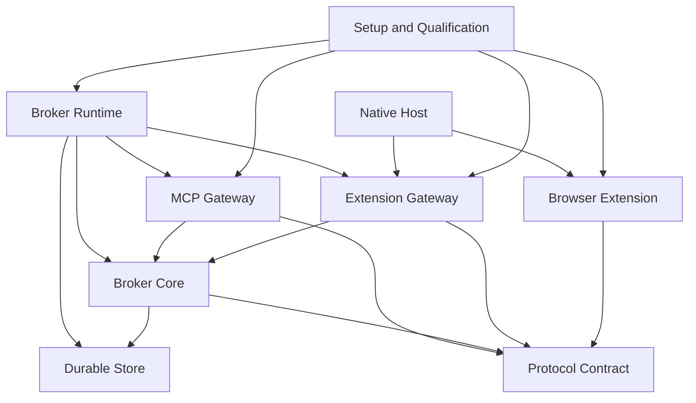

# Component architecture

Status: canonical Component decomposition for the implementation baseline.

Components are operational owners of confirmed System responsibilities. They may contain many modules, but no responsibility is shared implicitly: one component owns each decision or durable record, and collaborators communicate through explicit ports or versioned messages.

## Component map

### Eight components cover composition, agent access, broker policy, durability, extension transport, browser execution, shared contracts, and qualification

| Component | Repository owner | Primary responsibility |
| --- | --- | --- |
| Broker Runtime | `apps/broker` | Process composition, validated configuration, lifecycle, health, and dependency wiring |
| MCP Gateway | `packages/mcp-gateway` | Codex/Hermes transport adapters, caller evidence, fourteen tools, schema publication, and acknowledgement-delivery confirmation |
| Broker Core | `packages/broker-core` | Logical identity, authority, admission, routing, request lifecycle, scheduling, reconciliation, controls, status, and audit decisions |
| Durable Store | `packages/storage` | Atomic persistence, migrations, repositories, request/event/audit retention, and restart recovery queries |
| Extension Gateway | `packages/extension-gateway` and `apps/native-host` | Pairing transport, authenticated live connections, bounded framing, generation fencing, and extension message correlation |
| Browser Extension | `apps/extension` | Profile identity, user-visible pairing, browser observation, tab-group operations, `chrome.debugger` attachment, raw CDP execution, and event forwarding |
| Protocol Contract | `packages/protocol` | MCP wire schemas, domain value types, relay envelopes, capability manifests, public problems, and protocol versions |
| Setup and Qualification | `scripts` and `tests` | Installation, runtime registration, builds, fixtures, conformance, real-world scenarios, traces, and release evidence |

### Dependencies point inward toward contracts and broker decisions

Broker Core cannot depend on MCP, WebSocket, Native Messaging, Chrome APIs, or process-global configuration. Gateways translate transports into Broker Core ports. Durable Store implements repository ports and does not make routing or lifecycle decisions.

## Broker Runtime

### Broker Runtime builds one local application from validated dependencies

Broker Runtime loads local configuration, constructs storage, Broker Core, MCP Gateway, Extension Gateway, scheduler workers, event retention, and logging, then starts and stops them in dependency order.

It owns process signals, health endpoints, startup recovery sequencing, and configuration publication. It does not implement tools, routing policy, SQL queries, extension authentication, or CDP methods.

### Startup recovery finishes before external work becomes eligible

Startup opens and migrates the store, rebuilds logical indexes and lane barriers, restores control fences, initializes capability profiles, starts extension acceptance, reconciles live endpoints, and only then marks MCP mutation tools ready.

Readiness can distinguish `starting`, `reconciling`, `ready`, and `degraded`. A running HTTP listener alone is not proof that browser work is safe to accept.

## MCP Gateway

### MCP Gateway presents the exact version-one tool and schema catalog

MCP Gateway materializes every tool root from the canonical schema, validates all model-authored inputs, injects non-model caller evidence, invokes Broker Core application ports, and returns structured content plus a concise text fallback.

It supports runtime adapters for Codex and Hermes without changing tool bodies. Adapter configuration maps runtime evidence to the broker's session and lineage resolver; it never asks the model to compose caller, owner, or request identifiers.

### Acknowledgement delivery confirmation is an explicit gateway port

For an accepted asynchronous call, MCP Gateway writes the accepted ticket response and reports successful transport handoff to Broker Core. The broker does not make the ticket dispatch-eligible before that confirmation.

If transport handoff fails, the gateway reports failure. It does not retry the browser action, generate a replacement request, or infer that the model saw `request_ref`.

### Immediate reads remain bounded and scheduler-neutral

Context, event, and request reads call read-model ports. Terminal close calls one compare-and-write port. Gateway pagination validates page-size bounds and forwards opaque cursors without parsing their private contents.

## Broker Core

### Broker Core owns every logical decision and state transition

Broker Core is divided internally by responsibility:

- identity and authority resolution;
- endpoint, window, workspace, tab, and relationship registries;
- status projection and freshness;
- workspace allocation and deterministic ranking;
- request admission, acknowledgement gates, and lifecycle transitions;
- per-tab lanes, worker claims, control epochs, and backpressure;
- capability and managed-tab-scope admission;
- browser command, tab creation, child adoption, and event reconciliation;
- human resolution, stop, resume, kill, takeover, and termination coordinators; and
- audit-event construction.

These are modules inside one consistency boundary, not separate sources of truth.

### Application ports separate commands, queries, workers, and extension events

Broker Core exposes four port families:

| Port family | Callers | Examples |
| --- | --- | --- |
| MCP command ports | MCP Gateway | submit workspace, tab, CDP, resolution, control, takeover, termination |
| MCP query ports | MCP Gateway | context pages, request snapshot, event page, terminal close |
| Worker ports | Broker Runtime workers | claim next eligible request, checkpoint, reconcile, finish, release |
| Extension event ports | Extension Gateway | endpoint connected, browser snapshot, command result, CDP event, detach, disconnected |

All ports accept or return public references and typed facts where applicable. Only the extension port also carries private transport and browser locators, wrapped in fenced generation types.

### One transaction coordinator protects cross-entity invariants

Broker Core requests atomic store transactions for acceptance, acknowledgement outcome, lane-head claim, request terminalization, resolution, takeover, termination, control fences, public closure, and cursor-generation changes.

It never implements a distributed lock across MCP and extension transports. Durable epochs and compare-and-write conditions fence stale work.

## Durable Store

### Durable Store persists logical truth in SQLite transactions

The initial implementation uses one local SQLite database in WAL mode. Repositories expose typed transaction methods rather than arbitrary SQL to Broker Core.

The store owns schema migration and persistence for endpoints, pairing credentials, sessions and lineages, windows, workspaces, managed tabs, requests, request attempts, lane positions, control epochs, event streams, event pages, capability selections, status observations, public closure, and audit records.

### Separate tables preserve logical state, current locators, and append-only evidence

Logical entity tables hold current durable state. Generation tables hold replaceable connections, locators, attachments, and event streams. Append-only transition and audit tables record how current state was produced.

Raw bodies are stored only where required for an open request result or retained event page. Logs reference durable identifiers and hashes instead of duplicating large raw payloads.

### Repository queries rebuild schedulers and read models after restart

Recovery queries return open tickets, per-tab lane order, unconfirmed acknowledgement barriers, current control fences, possibly dispatched attempts, current owner authority, endpoint pairing, public terminal tickets, and event-stream generations.

Read-model queries implement bounded context and ticket-discovery pages with query, visibility, owner-epoch, ordering-snapshot, and cursor checks.

## Extension Gateway

### Extension Gateway authenticates one live generation per paired endpoint

The gateway completes pairing, validates persisted endpoint credentials, negotiates relay-protocol and capability versions, and registers one current connection generation. A replacement connection fences the older generation before it can return results.

Connection presence is a fact sent to Broker Core. Gateway never derives `usable`, `busy`, `failing`, workspace ownership, or retry policy itself.

### Native host carries production traffic while test transports share its schema

The native host frames stdin/stdout Native Messaging records and forwards them to the local gateway. Chrome and AdsPower installed profiles use this path so the extension never requires browser permission to open a loopback socket.

An in-process or loopback transport can exercise the same envelope, authentication, size limits, and connection-generation behavior in automated tests or developer diagnostics, but it is not an installed-profile fallback. No transport buffers replayable browser event history. Reconnect triggers broker reconciliation and a fresh stream baseline.

### Gateway correlation never becomes public request identity

Private relay message and command-attempt identifiers correlate extension acknowledgements, results, and events. They are generated below the MCP boundary and mapped to durable requests only after Broker Core validates endpoint, connection, tab, attachment, and attempt generations.

## Browser Extension

### Each profile-local extension persists one pairing identity and readable nickname

The extension creates a cryptographic pairing identity and nickname candidate in profile-local extension storage. It exposes pairing, reset, final nickname, Native Messaging readiness, and connection status in the options page.

Ordinary service-worker or browser restart preserves identity. Reset, reinstall, or re-pair creates a new identity and cannot inherit old logical workspaces.

### Browser inventory reconciliation precedes managed-tab mutation

The extension reports eligible windows, focus, tab groups, tabs, opener relationships, URLs, titles, and debugger attachment facts. The broker maps those observations to logical references.

Create, group, move, archive-rename, attach, and CDP operations accept only private broker-resolved locators carrying the expected generation. The extension rejects stale or mismatched locators rather than searching by title or guessing a replacement.

### Chrome debugger execution is a versioned adapter over raw protocol data

The executor manages attachment per tab, invokes `chrome.debugger.sendCommand`, forwards `onEvent`, records `onDetach`, and supports flattened child sessions only when negotiated. It returns raw protocol results and errors without interpreting website success.

Recent private attempt outcomes may be cached only to answer broker reconciliation after transport loss. The cache is bounded, generation-aware, and never becomes a second public ticket journal.

## Protocol Contract

### Protocol Contract publishes separate agent, broker, and extension schemas

The package contains:

- the exact canonical MCP version-one JSON Schema and generated or hand-checked Zod validators;
- internal domain value types and reference brands;
- the versioned extension relay envelope and message schemas;
- capability-manifest schemas and conservative profiles;
- public problem codes and private transport failure codes; and
- schema-version compatibility assertions.

Public MCP bodies cannot reuse a private relay envelope or Chrome identifier type accidentally.

### Capability manifests are generated from reviewed fixtures rather than live guesswork

Each supported extension/browser combination selects a checked-in capability manifest. Unknown combinations receive a conservative baseline. New method or parameter support requires contract tests and at least one real-browser fixture before it becomes eligible.

The manifest describes scope and support; Browser Extension executes. Broker Core decides admission.

## Setup and Qualification

### Installation scripts are idempotent and report explicit readiness

Setup scripts build artifacts, register the native host, register MCP configuration for Codex and Hermes, print extension load paths, verify broker health, and guide pairing. Re-running them repairs matching configuration without deleting pairing or workspace state unless reset is explicitly requested.

Runtime-specific templates remain separate from agent-visible MCP schemas.

### Automated tests progress from pure invariants to real browsers

| Layer | Evidence |
| --- | --- |
| Contract | JSON Schema compilation, Zod parity, closed inputs, tool catalog, relay-version compatibility |
| Unit | ranking, authority, status, state machines, lanes, epochs, retry bounds, retention, problem mapping |
| Integration | SQLite transactions, restart recovery, acknowledgement gating, gateway fencing, extension mock protocol |
| End to end | multiple agents, endpoints, workspaces, tabs, controls, reconnects, takeover, and termination |
| Real world | Codex plus Hermes, Chrome plus AdsPower, distinct profiles, native transport, physical close/reopen, soak and fault evidence |

### Qualification evidence changes the design only through an owned proposal

A failing test can fix an implementation defect directly when the canonical behavior is clear. A test that demonstrates an incompatible runtime or unusable threshold produces a proposal at the owning UX, UI, System, Component, or File level before changing canonical behavior.

Parent: [`Components MOC`](./_MOC.md).
