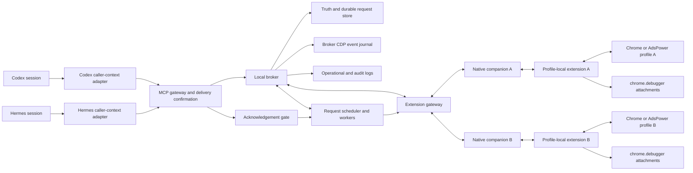

# System architecture proposal

Status: accepted historical proposal. Its approved architecture and the subsequently closed operational defaults are incorporated into [`../04-System/System-Architecture.md`](../04-System/System-Architecture.md). The approval blockers below are retained as decision history rather than current gates.

Authority requested: System.

Product parent: [`../01-Product/Product-Definition.md`](../01-Product/Product-Definition.md).

User Experience parent: [`../02-User-Experience/User-Experience-Definition.md`](../02-User-Experience/User-Experience-Definition.md).

User Interface proposal source: [`User-Interface-MCP-Contract.md`](./User-Interface-MCP-Contract.md), now incorporated with its schema into the canonical [`MCP contract`](../03-User-Interface/MCP-Contract.md).

This proposal realizes the confirmed Product and User Experience behavior through the candidate fourteen-tool User Interface. It does not promote that interface, choose its still-proposed public shapes, or decide questions owned by a parent authority.

## System boundary

### The broker coordinates every caller, browser resource, request, pause, and recovery decision

Codex and Hermes call one logical MCP boundary. Runtime adapters attach non-model-authored caller evidence, and the broker resolves that evidence into broker-issued session and lineage references before any browser context is read or changed.

The broker owns endpoint registration, logical window identity, workspace ownership, tab identity, routing truth, status truth, durable browser-request tickets, acceptance-delivery gating, phases, checkpoints, independent pause causes, control precedence, capacity decisions, command correlation, event-stream cursors, ticket visibility, and operational logs. Neither an agent nor an extension can assign workspace ownership, set request priority, or select a private browser destination independently.

The candidate User Interface contains ten asynchronous submissions, three immediate reads, and one immediate terminal-ticket close. Every asynchronous submission is durably ticketed, but no browser or extension work becomes dispatch-eligible until the MCP adapter confirms delivery of the accepted-ticket response to the caller.

### The paired extension executes browser work while the broker remains authoritative

The broker never opens a Chrome remote-debugging port, pipe, or DevTools WebSocket. It routes managed-tab work to the paired profile-local extension, and that extension uses Chrome extension APIs and `chrome.debugger` against private Chrome identifiers.

Chrome documents [`chrome.debugger`](https://developer.chrome.com/docs/extensions/reference/api/debugger) as an alternate CDP transport that attaches to tabs, sends commands, emits protocol events, and reports detach events. The extension reports browser observations and action outcomes, but those reports do not create broker identity, ownership, or request truth by themselves.

### Native Messaging transports bounded messages without buffering browser history

Each extension reaches the broker through its profile-local Native Messaging connection and a local companion. The companion frames and forwards messages; it does not allocate endpoints, authorize workspace use, resolve tabs, execute CDP, derive public status, or own durable state.

Chrome's [`Native Messaging` documentation](https://developer.chrome.com/docs/extensions/develop/concepts/native-messaging) limits one native-host-to-extension message to 1 MB and one extension-to-host message to 64 MiB. The relay therefore requires bounded envelopes and ordered chunking below the System boundary. The extension is not an alternate CDP-event replay buffer.

### Public browser identity stops at logical windows, workspaces, tabs, requests, and cursors

Every public CDP command carries `workspace_ref` plus a closed tab target containing `tab_ref`. Eligible existing browser windows use broker-issued `window_ref` values. Browser IDs, Chrome window and tab IDs, extension IDs, tab-group IDs, debugger targets, attachment identifiers, Native Messaging connections, and private command-attempt identities remain internal.

The System exposes no browser-wide target and no exclusive-browser workspace mode. Agent-requested tabs enter a workspace through `create_browser_tab`; opener-linked page children enter through broker reconciliation and adoption.

## Runtime topology

### One acknowledgement-gated broker connects many agent sessions to many extension endpoints



One broker can serve many Codex and Hermes sessions and pair many independent extension instances. Each participating browser profile has its own extension instance and endpoint. One session can own workspaces on several endpoints, independent sessions can own separate tab-group workspaces in one browser window, and related subagents can operate under the current workspace owner's lineage authority.

### The scripted installer prepares transports without becoming part of browser automation

The supporting setup sequence installs or updates the broker, registers the MCP server, registers the Native Messaging companion, installs a separate extension instance in each intended browser profile, lets each instance generate its endpoint nickname, pairs that instance after unique nickname registration, and verifies the extension-backed CDP path.

Exact scripts, packages, native-host paths, and runtime configuration files belong to Components and Files. This proposal requires only the readiness facts confirmed by User Experience and does not define installer retry or idempotency semantics.

## Source of truth

### Identity and binding truth includes logical windows and parent-child browser work

The broker is authoritative for:

- caller sessions and session lineages;
- paired extension nodes and nickname-addressable endpoints;
- broker-issued logical windows and their current private locators;
- workspaces, parent-child workspace relationships, owners, and lineage authority;
- managed tabs, opener relationships, and workspace membership;
- request ownership, visibility, closure, phases, checkpoints, and pause conditions;
- endpoint-wide kill state, accepted endpoint-control ownership fences, and workspace-level manual stop state; and
- connection, mapping, attachment, stream, ownership, and lifecycle generations.

The extension reports current Chrome windows, groups, tabs, opener links, focus, debugger facts, and outcomes. The broker reconciles those observations before changing logical truth.

### Routing truth maps every logical reference to current private generations

Routing truth contains these relationships:

```text
endpoint nickname
  -> extension_ref
  -> current extension connection generation
  -> browser_ref
  -> sticky endpoint-kill state + endpoint control epoch

window_ref
  -> endpoint
  -> private Chrome window ID + observation generation
  -> eligibility and last-focus observation

workspace_ref
  -> endpoint + window_ref
  -> private tab group + mapping generation
  -> optional parent_workspace_ref
  -> owner session + lineage authority + ownership epoch
  -> workspace lifecycle state + lifecycle epoch
  -> independent manual-stop state + stop epoch

workspace_ref + tab_ref
  -> window_ref
  -> private Chrome tab ID + mapping generation
  -> opener relationship + adoption source
  -> debugger attachment generation
  -> current event-stream epoch

request_ref
  -> current public authority under the approved UI rule
  -> exact normalized request
  -> acknowledgement-delivery status
  -> state + phase + checkpoint + pause condition
  -> scheduling class + accepted control, stop, ownership, and lifecycle epochs
  -> private worker, command, and transport attempts
  -> terminal result, failure, uncertainty, or public-close time

event cursor
  -> current owner visibility
  -> workspace_ref + tab_ref
  -> event-stream epoch + retained sequence position
```

A mapping is usable only while every referenced generation is current. Reconnect, replacement, adoption, takeover, kill, resume, termination, or outage changes the applicable generation or epoch so stale routing decisions cannot cross it silently. Takeover preserves endpoint-kill and manual-stop state, endpoint resume changes only endpoint-kill state, and successful termination ends the workspace lifecycle.

### Status truth records facts while pause and routing policy remain separate decisions

Status truth is the timestamped factual record of broker health, extension connections, browsers, focus observations, debugger attachments, endpoints, windows, workspaces, tabs, requests, acknowledgement delivery, checkpoints, command attempts, event continuity, and storage.

Request pause conditions are durable broker facts derived from confirmed control or connection events. The candidate public reasons are `extension_disconnected`, `user_confirmation_required`, `manual_workspace_stop`, and `endpoint_killed`; they accompany `queued` or `running` rather than becoming another request state.

Status truth does not decide endpoint assignment, window selection, request admission, dispatch, retry, ownership transfer, pause resolution, ticket closure, or termination. Those remain separately recorded broker decisions.

### Target selection resolves logical resources against current ownership, controls, and capability

For one tab-targeted request, target selection verifies:

1. caller and current owner-lineage authority;
2. workspace existence, lifecycle epoch, ownership epoch, and independent manual-stop state;
3. endpoint-kill state and control epoch;
4. tab membership in that exact workspace;
5. window, group, tab, and extension connection generations;
6. extension-backed capability and managed-tab confinement for the method and parameters;
7. debugger attachment availability; and
8. any browser-issued child `sessionId` against the current managed-tab attachment tree.

Submission uses current facts for admission. A worker revalidates every mutable fact before dispatch. A committed endpoint-kill, workspace-stop, ownership, or lifecycle transition prevents stale ordinary work from dispatching; an already-dispatched effect is reconciled rather than treated as cancelled. If the target changed, the broker pauses, reconciles, fails, or rejects according to the approved request journey; it never redirects work to an unrelated tab.

### Broker decisions preserve the facts and policy version that produced them

Capacity eligibility, deterministic assignment, focus-default window selection, admission, acknowledgement gating, target selection, control priority, retries, child adoption, pause, resume, ownership transfer, first-valid control claim, ticket closure, and termination each record their input facts and policy version.

This separation allows an endpoint to be connected yet killed, a workspace to exist yet be manually stopped, or a tab to be present yet unavailable for a command because current capability or ownership does not permit dispatch.

### Request, event, and audit truth keeps every recovery path reconstructable

The broker creates one public `request_ref` for every durably accepted asynchronous request and private identities for acknowledgement attempts, worker claims, browser-effect attempts, extension messages, attachment changes, reconciliation passes, event records, and control transitions. Public references support authorized agent work; private correlations support recovery and diagnosis and never become model-authored routing inputs.

## Domain model

### Durable logical entities remain distinct from replaceable browser connections and locators

| Entity | System meaning |
| --- | --- |
| Agent session | One runtime session resolved from non-model caller evidence |
| Session lineage | One top-level session and its authorized subagents operating under current owner authority |
| Extension node | One paired profile-local extension instance with broker-issued identity |
| Browser endpoint | One nickname-addressable browser profile represented by one paired extension node |
| Extension connection | One replaceable Native Messaging generation for an extension node |
| Browser observation | Version, platform, focus, windows, tabs, groups, opener links, and other reported facts at a time |
| Logical window | One broker-issued `window_ref` mapped to an observed private Chrome window generation |
| Workspace | One logical endpoint, window, tab group, lineage relationship, and optional parent workspace |
| Workspace ownership | The current owner session whose lineage can act under that authority |
| Workspace lifecycle | The current active or ended state and epoch used by termination and replacement |
| Workspace manual stop | One independent workspace-level pause state and epoch cleared only by the approved workspace-resume flow |
| Termination recovery pause | One active-workspace recovery condition retained when dispatched-work reconciliation or archive confirmation prevents termination success |
| Managed tab | One broker-issued `tab_ref`, adoption source, and initial event cursor inside one workspace |
| Tab locator | One private Chrome tab ID scoped to current connection and mapping generations |
| Debugger attachment | One replaceable `chrome.debugger` attachment generation for a managed tab |
| Child session record | One browser-issued CDP `sessionId` proven to belong to one current attachment tree |
| Browser request | One durable public ticket with exact normalized body, owner authority, scheduling class, accepted epochs, delivery gate, state, phase, checkpoint, pause condition, timestamps, and terminal payload |
| Managed-tab command lane | One private FIFO lane keyed by `workspace_ref` and `tab_ref`, with a broker-owned durable acceptance sequence and one full-cycle head claim retained through pause, reconciliation, and terminal commit |
| Endpoint control fence | One sticky endpoint-kill state and epoch with precedence over ordinary browser dispatch in every endpoint workspace |
| Endpoint ownership fence | One broker-private fence tied to one accepted endpoint kill or resume request that prevents workspace ownership changes on that endpoint until the request terminalizes |
| Workspace control lane | One fenced ownership-and-lifecycle transaction lane in which takeover and termination compete for the first valid control claim |
| Acknowledgement attempt | One private MCP response-delivery record that gates dispatch eligibility |
| Worker claim | One fenced lease or generation granting a worker authority to advance a request |
| Browser-effect attempt | One private creation, mutation, control, or CDP dispatch attempt within a request |
| Event stream | One broker-sequenced stream epoch for one managed tab |
| Event cursor | One broker-issued continuation position in one authorized stream epoch |
| Status observation | One timestamped fact with source and generation |
| Routing decision | One recorded policy result derived from current truth |
| Log record | One reconstructable lifecycle, control, routing, browser, or audit record |

### Durable acceptance precedes response delivery and response delivery precedes dispatch

Before returning `accepted`, the broker stores the caller and applicable authority, exact normalized request, broker-issued `request_ref`, initial `queued` state, initial phase and checkpoint, null pause condition, lifecycle timestamps, scheduling class, and applicable control, stop, ownership, lifecycle, and resource epochs. For `send_cdp_command`, the same transaction assigns a private monotonically increasing acceptance position in the lane identified by `workspace_ref` and `tab_ref`. Workspace acquisition records the requesting session's prospective-owner association before realization, while takeover records its replacement requester as authority for that takeover ticket before ownership changes. For endpoint kill or resume, the durable-acceptance transaction also validates complete endpoint-workspace ownership and installs a broker-private endpoint ownership fence tied to that request.

The stored request remains non-dispatchable while acknowledgement delivery is pending. The MCP adapter marks delivery confirmed only when its runtime transport contract confirms the accepted-ticket response was delivered. Only that durable confirmation makes a scheduler claim eligible to dispatch browser or extension work or commit an agent-visible endpoint or workspace pause fence, ownership transfer, or lifecycle transition. The broker-private endpoint ownership fence is acceptance coordination rather than an agent-visible pause effect. Priority never bypasses acknowledgement delivery.

If delivery fails, the broker records an immediate transport defect, exposes no browser side effect, and never dispatches the request. An endpoint kill or resume acceptance that fails delivery releases its private ownership fence in the same internal failure transition. The abandoned pre-dispatch record remains internal audit evidence rather than hidden accepted work that an agent must rediscover.

### Request state, progress, pause, and public visibility remain independent dimensions

Every accepted request begins `queued`, advances to `running`, and reaches one terminal state: `succeeded`, `failed`, or `uncertain`. `phase` and `checkpoint` record durable progress without changing that lifecycle vocabulary. A nullable pause condition can accompany only nonterminal work; terminal tickets clear it and never change terminal meaning afterward.

`create_browser_tab` and `send_cdp_command` do not use terminal `uncertain` for the confirmed recovery paths. A losing accepted takeover, termination, or human-resolution request finishes `failed`, never `uncertain`, after revalidation proves that another state transition won. Total replacement-creation exhaustion during `restart_failed` finishes both the original command and its winning resolver as `failed`, never `uncertain`. Other still-unmapped domain outcomes remain subject to User Experience and User Interface approval.

A terminal ticket has no public visibility timeout. Its applicable requester or current owner can close it: acquisition and takeover-control tickets use requester authority, while ordinary workspace-operation tickets use current-owner or preserved ended-workspace ticket authority. Closure records a public-close time and removes the ticket from agent views without deleting the immutable request and audit record.

### Ticket authority follows current workspace ownership rather than caller possession of a string

Workspace-acquisition and takeover-control tickets retain their requester authorities through terminal closure. Ordinary workspace-operation tickets use current-owner authority; authorized subagents can act under that authority but gain no independent entitlement. At a winning takeover commit, the broker atomically transfers every still-public owner-governed operation ticket—including terminal tickets not yet closed—to the replacement owner, removes former-owner access, and preserves original-caller attribution in audit. Requester-scoped tickets do not transfer.

Endpoint kill or resume is admitted only when the caller currently owns every active workspace using that endpoint; otherwise the broker rejects synchronously without a ticket and exposes workspace-level stop as the applicable alternative. Its broker-private endpoint ownership fence prevents later workspace ownership changes while the request is nonterminal. The authority and closure rule for a terminal endpoint-wide ticket after the fence releases and a later workspace ownership change remains a narrower candidate User Interface blocker.

## Extension CDP boundary

### The extension attaches and sends commands only against reconciled private tab locators

For a managed tab that needs CDP work, the extension calls `chrome.debugger.attach` against its current private Chrome tab ID and calls `chrome.debugger.sendCommand` only after broker dispatch authorization. It returns the raw command result or debugger API error without exposing the private tab ID as Octopus identity.

### Browser events and opener relationships feed broker reconciliation

The extension relays `chrome.debugger.onEvent` records with raw method, parameters, and optional child `sessionId`. Browser tab observations also include enough private opener and window information for the broker to detect opener-linked children.

The broker maps events and children through current connection and tab generations. A same-window child is added to the opener's group and receives a managed-tab record. A new-window child creates a tab-group workspace in that child window and receives new logical window, related workspace, tab, and cursor facts.

The extension listens to `chrome.debugger.onDetach`; the source, reason, and time become status and audit facts. The visible recovery for user-triggered debugger contention remains unresolved.

### One version-aware capability registry drives discovery and admission

The System derives a capability registry from extension-reported browser/version facts and the CDP domains and methods available through `chrome.debugger`. It intersects that support with a versioned managed-tab-confinement policy over each method and its target-bearing parameters.

`get_browser_context` projects a paginated view from that registry. `send_cdp_command` validates against the same current registry before admission and revalidates before dispatch. Unsupported or unprovably confined commands have no hidden full-CDP fallback.

Exact public capability fields remain a candidate User Interface choice. Registry artifacts, parameter schemas, update automation, and browser fixtures belong to Components and Files after System approves their source and failure policy.

### Browser-issued child sessions remain scoped to one current attachment tree

The broker registers a browser-issued child `sessionId` only from extension-relayed facts associated with one current root attachment. A later command may echo it unchanged, but target selection rejects a foreign, stale, or unknown handle before dispatch.

Flattened child sessions through `chrome.debugger` require Chrome 125 or later. The System must still choose whether that is the minimum browser version or older endpoints expose a reduced capability.

## Runtime flows

### Pairing establishes one uniquely named browser-profile endpoint

1. A distinct extension instance loads in one browser profile and opens its Native Messaging relay.
2. The instance generates the nickname for its endpoint and presents pairing proof.
3. The broker refuses to complete pairing while that nickname is already registered locally.
4. Successful pairing issues or resolves extension and browser references and creates a connection generation.
5. The extension reports browser/version facts and required API availability.
6. The broker records pairing, connection, browser, and CDP-readiness facts separately.

Nickname uniqueness is a System invariant. Reconnect, reinstall, re-pair, collision recovery, and retired-name continuity remain upstream decisions.

### Every MCP call resolves caller context before accessing broker truth

The runtime adapter supplies non-model-authored caller evidence. The broker verifies it, resolves session and lineage references, applies current owner authority, and rejects any tool argument that attempts to override caller context. Equivalent Codex and Hermes evidence remains a required runtime gate.

### Three reads and terminal-ticket close bypass the browser scheduler

`get_browser_context`, `read_cdp_events`, and `get_browser_request` return immediate authorized facts without creating request tickets or waiting for future browser execution. The candidate `close_browser_request` is also immediate, but its mutation is one atomic compare-and-write over terminal state, applicable requester-or-owner authority, and the current ticket or workspace-owner epoch. A takeover or other authority change that wins first makes a stale close fail revalidation; successful close records irreversible public closure and retains internal audit.

### Ten candidate submissions use one durable acceptance and delivery gate

The candidate asynchronous tools are `request_browser_workspace`, `create_browser_tab`, `send_cdp_command`, `take_over_workspace`, `terminate_workspace`, `resolve_browser_request`, `stop_workspace_automation`, `resume_workspace_automation`, `kill_browser_endpoint`, and `resume_browser_endpoint`.

Each tool first validates its schema, trusted caller context, applicable owner authority, logical targets, and tool-specific admission facts. A rejected submission has no public ticket. An accepted submission stores its ticket, returns the queued ticket, waits for confirmed acknowledgement delivery, and only then enters scheduler eligibility.

The asynchronous `resume_workspace_automation` name and mode are approved. The other four added control names and modes plus the asynchronous mode proposed for `resolve_browser_request` remain candidate User Interface choices rather than canonical surfaces.

### `get_browser_context` projects bounded endpoint, window, capability, workspace, tab, and request-summary facts

The broker reads current truth, applies owner and lineage visibility, applies the requested targeted view, and returns only the candidate schema's facts. Window projections use logical references, current eligibility, and focus observations. Capability projections use the current versioned registry. Every tab fact includes its current initial event cursor. The candidate `workspace_requests` view returns a bounded page of current-owner-visible workspace-operation summaries so a replacement owner can discover transferred broker-issued ticket references before reading full tickets; requester-scoped and endpoint-wide tickets are excluded. Its cursor is bound to workspace, state filter, ordering snapshot, caller visibility, and owner epoch; terminalization can advance the snapshot, while takeover or another owner-epoch change invalidates rather than reuses the cursor.

Context never embeds raw event history, diagnostic logs, private browser identifiers, or unrelated agent work.

### `request_browser_workspace` admits only satisfiable distinct-endpoint capacity

Before ticket issuance, the broker validates the requested count, normalizes repeated designated endpoint nicknames so each endpoint counts once, validates any designated `window_ref`, and checks the availability of enough connected eligible distinct endpoints. It rejects insufficient capacity or an unavailable designated endpoint or window synchronously, creates no ticket, and creates no workspace. The normalization of repeated entries that name conflicting window references remains a User Interface decision.

For an admissible request, the broker uses the eventually approved ranking policy and reserves each selected endpoint once within that request's admission transaction. This distinctness reservation is not exclusive ownership of the endpoint across sessions. A designated eligible window is used as submitted; otherwise the endpoint's most recently focused eligible existing window is selected from current focus observations. The worker creates or resumes a tab-group workspace in that existing window and does not open another browser window.

A persisted workspace whose group or every tab is physically gone is ended under a new lifecycle epoch. The worker creates a replacement with a new `workspace_ref`, stores the ended-to-replacement relationship, and returns both sets of facts.

Success contains exactly the requested number of distinct endpoint workspaces, each with at least one tab and initial cursor. If creation fails after admission, the request finishes `failed` under the confirmed journey, keeps every workspace already created, and records those references as known failure facts; it never reports a partial-success result.

### `create_browser_tab` reconciles before no more than three creation attempts

Before admission, the broker validates current owner authority and an active workspace. After acknowledgement delivery, a fenced worker records a creation attempt, asks the extension to create a tab in the workspace window, adds it to the workspace group, and confirms final membership before issuing `tab_ref` and an initial cursor.

If an attempt lacks a conclusive result, the request remains nonterminal and the workspace remains active. The broker reconciles the current window, group, and tabs. If the intended tab exists, it adopts that tab and succeeds. It retries only after proving the effect absent, only while the workspace remains active, and no more than three creation attempts in total. Exhaustion finishes `failed`; this flow never finishes `uncertain`.

An extension disconnect records `extension_disconnected` with the current durable phase and checkpoint. Reconnect to the same endpoint triggers reconciliation before the worker resumes or retries.

### Opener-linked children are adopted without an agent-created request

When reconciliation observes a child with a managed opener, the broker fences the opener mapping and inspects the child's window. A same-window child is moved into the opener's tab group, receives `tab_ref`, adoption source, and an initial event cursor, and becomes visible in that workspace.

A new-window child receives a logical window record, a tab group, a related child workspace with `parent_workspace_ref`, a managed tab, and an initial cursor. Adoption records remain attributable to the opener and browser observations even though no agent submitted `create_browser_tab`.

### `send_cdp_command` dispatches every raw command asynchronously after ticket delivery

Before admission, the broker validates current owner authority, workspace and tab, optional child `sessionId`, extension support, and managed-tab confinement. After durable acceptance and confirmed response delivery, a fenced worker waits for every earlier managed-tab lane position to reach terminal commit or confirmed acknowledgement failure, acquires that lane's full-cycle head claim, and revalidates ownership, control state, connection and attachment generations, and capability. An earlier position awaiting acknowledgement delivery or remaining nonterminal is a barrier; only confirmed acknowledgement failure permanently skips that position.

The worker establishes or verifies the debugger attachment, creates a private command attempt, records a pre-dispatch event barrier, and sends explicit dispatch authorization. The extension then invokes `chrome.debugger.sendCommand`, records a post-invocation acknowledgement, and relays the raw result or debugger error.

A raw result or conclusive debugger error finishes under the approved terminal mapping and atomically releases the head claim. Browser-task meaning remains the agent's responsibility.

### Reconnect ambiguity pauses a raw command until `resolve_browser_request`

If the extension connection is lost, the request keeps its `queued` or `running` state, phase, checkpoint, `extension_disconnected` pause condition, and full-cycle head claim. Later same-tab commands remain queued. After the same endpoint reconnects, the broker reconciles the target tab and current browser state before deciding whether the head can advance.

When reconciliation still cannot prove whether a dispatched raw effect occurred, the original command stays nonterminal with `user_confirmation_required` and retains the lane. It is neither replayed nor completed as terminal `uncertain`.

The candidate asynchronous `resolve_browser_request` validates current owner authority, the target command and pause reason, and one decision, then conditionally acquires a target-resolution epoch so only one accepted resolver can advance that target. It executes outside the blocked ordinary tab lane. A losing concurrent resolver cannot mutate the browser or release the target and finishes `failed`, never `uncertain`; its exact problem body remains a User Interface choice.

For `confirmed_succeeded`, one broker transaction completes the target command as `succeeded` with human-confirmed evidence, completes the winning resolver ticket with its resolution facts, and releases the head. This broker-only commit remains eligible while endpoint kill or workspace stop is active because it performs no browser mutation.

For `restart_failed`, the broker first stores the decision while the target retains its lane. It does not bypass endpoint-kill or manual-stop fences: replacement work remains paused until every applicable browser-mutation fence clears. Once eligible, it uses the existing `create_browser_tab` recovery discipline: reconcile before the initial replacement attempt and before no more than two retries, and retry only after proving the prior attempt absent.

If a replacement tab and its cursor become durable, one broker transaction completes the original command as `failed` with `effect_may_have_occurred: true`, completes the winning resolver with replacement facts, fails every already-queued follower targeting the old `tab_ref` without browser dispatch or retargeting, and releases the old lane. The old tab remains managed for inspection, and only this successful branch returns the replacement references.

If all three replacement attempts are exhausted, one broker transaction completes the original command as `failed` with `effect_may_have_occurred: true`, completes the winning resolver as `failed`, fails every already-queued old-tab follower without browser dispatch or retargeting, and releases the old lane. The old tab remains managed, the workspace remains active, and no replacement `tab_ref` or event cursor is published. The original and resolver use a null public problem and the same exact exhaustion facts, and each exposes `create_browser_tab` for the active workspace. The owner can use that ordinary journey afterward, with its existing reconciliation and three-attempt recovery rules. Exact public problem codes for the invalidated followers remain a User Interface choice.

Resolution never overrides endpoint kill or workspace stop. The broker records the fence that blocks `restart_failed`, keeps the resolution and target nonterminal at their checkpoints, and reevaluates eligibility only after endpoint resume or workspace resume clears the applicable cause.

### `get_browser_request` returns one owner-authorized ticket snapshot

The broker resolves the supplied `request_ref`, applies the applicable ticket-authority rule, and returns the exact normalized request, state, phase, checkpoint, nullable pause condition, timestamps, and state-appropriate terminal payload. Ordinary workspace tickets use current-owner authority; acquisition uses prospective-owner authority; and the replacement requester keeps authority over its own takeover ticket through terminal polling and closure even if it loses. A nonterminal poll includes an executable poll action for the same reference; `user_confirmation_required` exposes the candidate resolution action. Polling is lane-neutral and cannot release or prolong a managed-tab head claim.

Knowledge of a ticket string never grants access. Related subagents act only through current-owner lineage authority. At a winning takeover commit, the replacement owner gains access to every still-public owner-governed workspace-operation ticket and the former owner loses it immediately. Acquisition and competing takeover-control tickets remain requester-scoped. The candidate paginated `workspace_requests` projection supplies previously unknown transferred operation references under the new owner epoch. Closed terminal tickets are absent from public request views but remain in internal audit.

### `read_cdp_events` reads one required-cursor stream immediately

The broker validates owner visibility, workspace-tab relationship, and the non-null cursor's stream epoch and retained position. It returns one bounded page immediately and never waits for future events.

Every managed tab starts with an initial broker-issued cursor. An extension or broker outage invalidates the old stream epoch. After recovery, the broker reconciles the same logical tab against the current live page, creates a new stream epoch and initial cursor, and projects the candidate current-page baseline. It does not reload the page, replay invalidated events, or request replay from the extension.

The exact recovery disposition and baseline fields remain candidate User Interface decisions; the no-reload, no-replay, new-cursor boundary is confirmed.

### `take_over_workspace` transfers ownership and workspace-scoped ticket authority atomically

Before admission, the broker verifies that `workspace_ref`, endpoint nickname, and previous owner reference identify one current binding and records the replacement requester as durable authority for that takeover-control ticket. After delivery and worker revalidation, it enters the workspace control lane and attempts the first valid control claim. A winning takeover claim increments the ownership epoch, installs the replacement owner, transfers every still-public owner-governed workspace-operation ticket, marks takeover succeeded, and invalidates new former-owner routing decisions in one transaction. Workspace-acquisition and competing takeover-control tickets remain with their requesters through terminal closure.

An active broker-private endpoint ownership fence prevents this ownership-changing commit for every workspace on that endpoint until the associated kill or resume request terminalizes. Whether a takeover attempt encountered during that interval is rejected synchronously or accepted and waits for the fence remains an explicit User Interface and System admission-policy decision. The fence does not itself terminate the takeover or change the workspace owner.

Takeover remains eligible while endpoint-kill or manual-stop state is present and preserves both pause causes. A concurrent termination and takeover have no fixed priority within their shared control class; the first valid control claim wins, and the other request revalidates without mutating stale state and finishes `failed`, never `uncertain`. Its exact problem body and available actions remain User Interface choices.

The workspace, browser state, tabs, event streams, and open ticket records remain after successful takeover. The winning commit does not wait for ordinary work already dispatched by the previous owner. It fences the stale worker claim, preserves the original caller in audit, and makes a replacement-owner-authorized worker continue that request's reconciliation from its durable checkpoint. The transferred ticket and eventual result are visible to the replacement owner and unavailable to the former owner.

### Candidate workspace stop pauses automation without terminating browser context

After owner validation and acknowledgement delivery, `stop_workspace_automation` commits the workspace's second-priority ordinary-action fence, records independent `manual_workspace_stop` state, blocks not-yet-dispatched ordinary browser-automation actions, pauses affected nonterminal work at durable checkpoints, and preserves tabs, ownership, ticket access, context, and other reads. It can coexist with endpoint-kill state, while eligible takeover and termination control work remains exempt from that ordinary-action fence.

Manual stop does not archive or terminate the workspace. Takeover and termination remain eligible while it is present, and a later `terminate_workspace` remains separate.

### `resume_workspace_automation` reconciles before clearing one manual stop

After current-owner validation and acknowledgement delivery, `resume_workspace_automation` reconciles the workspace's current group, tabs, attachment generations, and request checkpoints. Only after that reconciliation succeeds does one fenced control commit clear `manual_workspace_stop`. It does not clear endpoint-kill state, restore a terminated workspace, change ownership, or replay a browser request. If endpoint kill remains active, clearing the manual cause does not make ordinary automation dispatchable.

### Candidate endpoint kill remains sticky until resume reconciles every affected workspace

Before admission, `kill_browser_endpoint` verifies that the caller currently owns every active workspace using the endpoint. A failed complete-ownership check rejects synchronously without a ticket and exposes workspace-level stop as the applicable alternative. Durable acceptance atomically installs the request's broker-private endpoint ownership fence, so no takeover can change ownership on that endpoint until kill terminalizes. After successful validation and acknowledgement delivery, the request advances the endpoint control epoch and commits the highest-priority ordinary-action fence across that endpoint. It records sticky killed state, blocks not-yet-dispatched ordinary browser actions, and pauses each affected workspace and nonterminal request with `endpoint_killed` at its durable checkpoint. Independent manual-stop state remains present, and termination may still proceed because it changes lifecycle rather than ownership.

`resume_browser_endpoint` applies the same complete-ownership admission rule and otherwise rejects synchronously without a ticket. Its durable acceptance installs the same broker-private endpoint ownership fence. After its accepted response is delivered, a fenced worker reconciles the endpoint's current windows, groups, tabs, attachments, surviving workspaces, and request checkpoints. Only reconciled work can continue. Resume clears only endpoint-kill state, preserves each independent `manual_workspace_stop`, and does not restore a successfully terminated workspace.

The kill or resume terminal commit releases its endpoint ownership fence atomically with the terminal result. The fence does not govern workspace termination or endpoint allocation, and this System proposal does not infer any additional exclusion for those operations. Admission authority is confirmed. The authority and closure rule for a terminal kill or resume ticket after fence release and a later ownership change, plus the remaining kill and resume failure bodies, remain candidate User Interface blockers.

### `terminate_workspace` remains separate from pause controls

Before admission, the broker validates current owner authority and workspace state. After delivery, a fenced worker enters the same workspace control lane as takeover and attempts the first valid termination claim. Termination remains eligible while endpoint-kill or manual-stop state is present. A winning claim immediately fences new ordinary browser work and finishes every accepted ordinary request that has not begun browser execution as `failed`; none of that work is dispatched, replayed, or retargeted.

Browser work already dispatched before the termination fence is reconciled rather than cancelled, and termination remains nonterminal while that reconciliation is incomplete. After every dispatched effect reaches a conclusive terminal result, the worker asks the extension to append the `archive` suffix and requires confirmed browser observation of that rename. Only then does one lifecycle commit end agent control, make prior attachment generations unavailable to new work, mark termination `succeeded`, and leave the archived tab group open for manual closure.

If dispatched-work reconciliation or archive confirmation fails, termination finishes `failed`, never ends the workspace, and leaves the active workspace paused for recovery with its tabs, owner authority, tickets, and current observations intact. A later recovery or termination attempt starts from those durable facts. A concurrent takeover and termination still have no fixed priority: the first valid control claim wins, and the losing accepted request revalidates and finishes `failed`, never `uncertain`. Exact failure problem bodies and available actions remain User Interface choices.

## Event ordering

### Each managed tab has one broker-sequenced stream per live connection epoch

Every relayed raw event is mapped through the current tab and attachment generation before the broker appends it to the current stream. Events from stale or unknown generations are logged and cannot be attributed to the current tab.

The broker, not the extension, owns retained event pages and cursor positions. Related subagents reading under owner authority can use separate cursors over the same current stream.

### A two-phase command handshake separates event position from dispatch proof

For `send_cdp_command`, the broker associates a pre-dispatch stream barrier with the public request and private attempt before sending dispatch authorization. The extension emits a separate post-invocation acknowledgement after calling Chrome.

The barrier establishes event ordering but does not prove browser invocation. A failure before authorization is pre-dispatch. Loss after authorization requires reconciliation and can lead to `user_confirmation_required`; it never licenses automatic replay.

### Outage recovery starts a fresh stream from reconciled current-page facts

Extension disconnect and broker restart invalidate the current stream epoch and every cursor in it. After the current logical tab is reconciled, the broker records a fresh baseline observation and issues a new initial cursor. Prior events remain audit data subject to retention policy, not a public replay stream.

## Concurrency

### Resource-scoped lanes identify browser scheduling boundaries without defining cross-lane guarantees

The broker uses a durable request queue, fenced workers, and endpoint-, workspace-, tab-, and control-scoped execution lanes. Immediate reads do not consume a managed-tab command lane. Concurrency, fairness, and dispatch ordering across different tabs, workspaces, and endpoints remain System approval decisions.

### Worker claims fence every phase, checkpoint, and terminal write

Before advancing a dispatch-eligible request, a worker acquires a durable claim generation. Every later checkpoint, pause, reconciliation, dispatch, and terminal write compares that generation with the request's current claim and applicable resource epochs. A crashed or superseded worker cannot continue after a newer claim exists. Takeover supersedes a former-owner worker claim but does not cancel the underlying request; a new claim under the replacement-owner epoch continues reconciliation from the stored checkpoint.

Recovery may resume conclusively pre-effect work from its checkpoint. It may retry a browser mutation only after reconciliation proves the prior effect absent. Raw command ambiguity requires human resolution rather than replay.

### Control precedence is a scoped hierarchy rather than an agent-configured global queue

After acknowledgement delivery, endpoint kill commits the highest-priority ordinary-action fence across its endpoint, workspace stop commits the next-priority fence inside its workspace, takeover and termination use a higher-than-CDP workspace control lane, and ordinary CDP remains the lowest-priority browser work. Kill and stop are independent overlays and can coexist; they are not competing queue entries.

Takeover and termination remain eligible while either committed pause overlay is present. They share one ownership-and-lifecycle control lane and use the first valid control claim rather than a fixed priority between them. A broker-private endpoint ownership fence created by an accepted kill or resume prevents takeover from changing ownership until that endpoint request terminalizes; it does not prevent termination. Whether a blocked takeover attempt waits or is rejected remains open. A committed higher-priority control blocks not-yet-dispatched ordinary work in its scope. Work already dispatched is never inferred cancelled and proceeds through reconciliation.

### Each managed tab completes one accepted request cycle at a time in ticket-acceptance order

Related agents may submit several commands against one managed tab. The durable lane position assigned at acceptance is the sole order for acknowledged commands sharing that `workspace_ref` and `tab_ref`; public timestamps and `request_ref` values are not ordering keys. Once an acknowledged request reaches the head, its full-cycle claim covers pre-dispatch waiting, browser action, pause, reconciliation, and terminal commit. A delivery-pending or nonterminal earlier position remains a lane barrier, while confirmed acknowledgement failure permanently skips that position and cannot block later work.

A pause never releases the full-cycle head claim. Reconnect reconciliation or owner-authorized human resolution advances that head to a terminal commit; only that commit atomically releases the lane for its next accepted request. Direct request polling does not participate in lane ownership.

### Lifecycle and control mutations use epochs instead of broad global locks

Workspace replacement, tab insertion, child adoption, ownership transfer, manual stop and workspace resume, endpoint kill and resume, termination, tab closure reconciliation, and attachment replacement advance only their affected epochs. Every worker revalidates endpoint-control, endpoint-ownership-fence, manual-stop, ownership, lifecycle, and target epochs before browser dispatch or workspace-state commit. Takeover preserves both pause overlays, workspace resume advances only the manual-stop epoch, endpoint resume advances only the endpoint-control epoch, and successful termination ends the lifecycle. Endpoint kill or resume durable acceptance installs its ownership fence; acknowledgement failure or terminal commit releases it without broadening that fence to lifecycle termination or endpoint allocation.

### Accepted browser work outlives its MCP call only after delivery confirmation

Closing the submitting MCP call after confirmed accepted-response delivery does not cancel the request. Failure before delivery confirmation prevents dispatch and leaves only internal defect evidence. The contract has no caller-authored idempotency key, so duplicate submissions cannot be inferred from payload equality.

### Elapsed time and agent disconnect never terminalize an accepted request

The public contract has no per-request cancellation, caller deadline, broker-imposed terminal timeout, or queue-removal action. A watchdog can detect a lost worker claim, expose that work is stalled, fence the stale worker, and assign a valid replacement claim; it cannot finish the request merely because time elapsed. Agents use resolution, workspace stop or resume, endpoint kill or resume, takeover, or termination to change execution conditions, and they close only already-terminal tickets.

## Status and decisions

### Status records preserve source, time, generation, phase, and control state

| Subject | Example internal facts |
| --- | --- |
| Broker | process generation, MCP readiness, request-store readiness, scheduler generation, store health |
| Extension | pairing state, connection generation, heartbeat, version, last-seen time |
| Browser | reported product, platform, windows, focus, tabs, groups, opener links, observation time |
| Endpoint | source observations, current derived condition, sticky killed state, endpoint control epoch, active private ownership-fence request and epoch, and control-fence commit |
| Logical window | private locator generation, eligibility, last-focus observation, workspace set |
| Workspace | owner, lineage, parent workspace, ownership epoch, lifecycle state and epoch, independent manual-stop state and epoch, termination claim or recovery pause, group and tab observations |
| Managed tab | locator generation, opener, adoption source, title, URL, attachment and stream epochs |
| Browser request | normalized body, delivery status, scheduling class, accepted control epochs, state, phase, checkpoint, pause condition, timestamps, optional stalled observation, owner authority, worker or control claim, terminal evidence, public close time |
| Browser-effect attempt | target generations, attempt count, barrier, dispatch authorization, acknowledgement, result, error, or reconciliation evidence |
| Event stream | stream epoch, head, tail, retention boundary, gap, baseline, last append time |

Public conditions are projections over these facts. Supporting broker, extension, browser, workspace, and debugger-usability vocabularies and freshness promises remain upstream decisions.

### Routing policy converts facts into admission, pause, resume, and available-action decisions

Allocation and routing evaluate current owner authority, complete endpoint-workspace ownership for endpoint-wide controls, any accepted endpoint ownership fence, endpoint and workspace controls, control precedence, resource epochs, capability policy, and capacity rules. The broker records the decision separately from factual condition so a connected endpoint can remain unavailable because it is killed, a present workspace can remain read-only because it is manually stopped or awaiting termination recovery, or an ownership-changing takeover can remain fenced while endpoint kill or resume is nonterminal.

## Logs

### Broker logs reconstruct admission, delivery, browser effects, reconciliation, and owner controls

The logging subsystem records:

- broker, scheduler, gateway, and store start, stop, restart, and generation changes;
- extension pairing, connection, reconnect, heartbeat loss, and revocation observations;
- browser window, focus, workspace, child, and tab reconciliation;
- endpoint capacity candidates, distinctness, reservations, window selection, shortfall, and rejection;
- durable ticket creation, exact normalized body, acknowledgement-delivery attempt, confirmation, or failure;
- request state, phase, checkpoint, pause condition, full-cycle lane claim, worker claim, resource-epoch validation, and atomic terminal release;
- debugger attach, detach, contention, and reattach attempts;
- command barrier, authorization, post-invocation acknowledgement, raw result, debugger error, and ambiguity evidence;
- bounded tab-creation and replacement attempts, reconcile-before-retry evidence, failed old-tab followers, and prohibited-retarget decisions;
- event stream creation, cursor issuance, reads, invalidation, fresh baseline, retention gaps, and completion;
- workspace replacement and opener-child adoption relationships;
- takeover-request requester authority, endpoint-ownership-fence admission result, winning ownership and active-ticket transfer, former-owner denial, and transferred-ticket discovery;
- control acknowledgement, scheduling class, endpoint and workspace fence commits, and blocked pre-dispatch work;
- first-valid takeover or termination control claims and conclusively failed losing-request revalidation;
- workspace stop and resume, endpoint kill and resume, complete-ownership admission, private ownership-fence installation and release, reconciliation, and preserved independent pause state;
- reconciliation evidence for already-dispatched work that a later control did not cancel, including replacement-owner worker adoption after takeover;
- human resolution decision, winning or failed race claim, known-side-effect marker, replacement attempts, successful replacement facts or total exhaustion without a replacement reference, failed old-tab followers, lane release, and retained old tab;
- watchdog stall observations and worker-claim replacement without timeout terminalization;
- terminal ticket public closure with internal audit retention; and
- termination fence, failed not-started work, dispatched-work reconciliation, archive confirmation, failed recovery pause, lifecycle end, and manual-closure state.

Ordinary browser context and request polling never become log dumps. Internal raw-payload retention, redaction, and export remain unresolved System policies; public oversized-payload representation remains a User Interface decision.

## Persistence and recovery

### Durable logical records remain separate from replaceable live generations

Session, lineage, extension, endpoint, logical window, workspace, ownership, tab, request, acknowledgement, checkpoint, pause, control, endpoint-ownership-fence, reconciliation, event-stream metadata, decision, and audit records are durable according to their eventual retention contracts. Native connections, private Chrome locators, debugger attachments, worker processes, and in-flight transport identities are live generations.

### Same-endpoint reconnect reconciles every paused resource before continuation

An extension disconnect invalidates its connection, locator, attachment, and event-stream generations. Affected nonterminal requests keep their lifecycle states and durable checkpoints and receive `extension_disconnected` unless a stronger manual or endpoint control already governs them.

Only a reconnect proven to be the same endpoint can begin continuation. The broker obtains fresh window, group, tab, opener, focus, and browser observations, reconciles logical resources, creates fresh event streams and cursors, and resumes requests from checkpoints only when their prior effects are known. Reinstall and re-pair identity remain upstream decisions.

### Debugger detach invalidates one attachment without silently changing workspace truth

`chrome.debugger.onDetach` invalidates the affected attachment and child sessions but does not by itself terminate a workspace. A later reattach requires current connection and tab mapping. User-triggered DevTools contention and visible reattach behavior remain unresolved.

### Reconciliation distinguishes absent effects from ambiguous raw effects

Tab creation can retry only after proving its intended tab absent, with at most three total attempts. A raw CDP command that may have executed but has no conclusive result cannot be repeated; after reconnect reconciliation it waits for owner-mediated human resolution.

No recovery step reloads a page merely to reconstruct event state. Old event streams are invalidated, and the current live page receives a new broker cursor.

### Public ticket closure never deletes durable audit evidence

Terminal tickets remain visible to their applicable requester or current owner without an automatic timeout. Candidate `close_browser_request` records irreversible public closure while preserving the request, terminal evidence, owner history, and diagnostic correlations internally.

### Broker-restart continuation remains conditional on upstream approval

The public continuity of queued, running, and open terminal tickets across broker restart remains unresolved. Any approved continuation must fence old worker claims, re-establish owner authority, reconcile live browser generations, and preserve the no-replay and acknowledgement-delivery boundaries.

## System invariants

### Cross-boundary invariants keep ticketed extension automation coherent

1. Every model-visible Octopus reference and cursor is broker-issued before an agent echoes it; endpoint nicknames are extension-generated, while browser-issued CDP handles remain raw protocol data rather than Octopus references.
2. Runtime caller evidence is attached outside model-authored arguments.
3. Every participating profile has one extension instance and endpoint; within one capacity request, one endpoint satisfies the requested workspace count at most once.
4. Pairing never hard-binds an endpoint to an agent.
5. Every public window is broker-issued and maps to one current endpoint window generation.
6. Every workspace maps to one endpoint, one existing browser window, one tab group, one current owner authority, and one lifecycle epoch.
7. Every public tab target repeats its owning `workspace_ref`; each tab fact includes its current initial event cursor.
8. Private Chrome IDs are never durable public identity.
9. A persisted workspace with no live group or tabs ends; replacement uses a new `workspace_ref`.
10. Same-window opener children join the opener workspace; new-window children receive a related child workspace.
11. The extension is the only CDP executor, and there is no remote-debugging fallback.
12. Proactive capability facts and reactive admission use the same versioned capability and confinement policy.
13. Unsupported or unconfined CDP work is never dispatched.
14. The broker stores a normalized request ticket before exposing `request_ref`.
15. No browser or extension dispatch occurs until accepted-response delivery is confirmed.
16. Failed acknowledgement delivery produces no browser dispatch and remains an internal transport defect.
17. Accepted is a submission disposition; request state remains `queued`, `running`, `succeeded`, `failed`, or `uncertain`.
18. Phase, checkpoint, and nullable pause condition remain distinct from lifecycle state.
19. A terminal request never changes state or terminal payload and has no pause condition.
20. Every terminal payload's tool discriminator matches its stored request tool.
21. `create_browser_tab` reconciles before retry, makes at most three creation attempts, preserves the active workspace, and never terminates uncertain.
22. `send_cdp_command` is always asynchronous and never automatically replays a reconnect-ambiguous effect.
23. An unprovable raw effect remains nonterminal with `user_confirmation_required` until owner-mediated resolution.
24. `restart_failed` records a possible prior effect and makes no more than three replacement attempts after applicable fences clear. Success atomically fails the original command and old-tab followers, completes the resolver with replacement facts, and releases the lane. Total exhaustion atomically fails the original command, resolver, and old-tab followers, releases the lane, leaves the workspace and old tab active, and publishes no replacement reference. Neither branch dispatches or retargets old-tab followers.
25. Extension disconnect pauses at a durable checkpoint; same-endpoint reconnect reconciles before continuation.
26. No agent-visible endpoint-kill or workspace-stop pause fence, ownership transfer, or lifecycle transition takes effect before its accepted acknowledgement is delivered. The broker-private endpoint ownership fence is installed at durable kill or resume acceptance and releases on delivery failure or terminal commit.
27. Endpoint kill is the highest-priority ordinary-action fence; workspace manual stop is the next-priority fence in its workspace; both remain independent and may coexist.
28. Takeover and termination remain eligible while killed or manually stopped and use the first valid workspace control claim rather than a fixed priority between them; a losing accepted takeover or termination finishes failed, never uncertain.
29. Takeover preserves endpoint-kill and manual-stop state; workspace resume clears only manual-stop state after reconciliation; endpoint resume clears only endpoint-kill state after reconciliation.
30. Ordinary CDP is the lowest-priority browser work; a termination claim fails accepted work that has not begun browser execution, while already-dispatched work reaches reconciliation rather than inferred cancellation.
31. Successful termination requires conclusive dispatched-work reconciliation and confirmed archive rename before ending the lifecycle; either failure leaves the workspace active, paused, and recoverable while the termination request finishes failed.
32. Broker or extension outage invalidates the prior event stream; recovery creates a fresh cursor from current-page facts without reload or replay.
33. Current owner authority governs ordinary workspace tickets; acquisition uses prospective-owner authority, and a replacement requester retains authority over its own takeover ticket through terminal polling and closure whether or not takeover wins.
34. A winning takeover immediately transfers every still-public owner-governed workspace-operation ticket, removes former-owner access, and exposes transferred references through a bounded owner-visible discovery view whose cursor is bound to the caller's current owner epoch; acquisition and takeover-control tickets remain requester-scoped through terminal closure.
35. Endpoint kill or resume is admitted only when the caller owns every active workspace on that endpoint; a failed check creates no ticket and exposes workspace-level stop instead. Durable acceptance installs a broker-private endpoint ownership fence that prevents takeover commits until terminalization and then releases atomically; the fence does not govern termination or allocation.
36. Terminal tickets have no public timeout; closure by the applicable requester or current owner removes only public visibility and retains audit.
37. No request is cancelled, removed, or terminalized because an agent disconnects or time elapses; watchdogs fence stale workers without inventing terminal outcomes.
38. Acknowledged commands sharing one `workspace_ref` and `tab_ref` retain one full-cycle lane claim at a time in their private durable ticket-acceptance sequence; pause and reconciliation do not permit overtaking.
39. Status observations remain facts; routing and control choices remain recorded decisions.

## Traceability

### Fourteen candidate tools map to ten asynchronous requests, three reads, and one close control

| Candidate User Interface tool | System realization |
| --- | --- |
| `get_browser_context` | Immediate owner-scoped projection of broker, endpoint, window, capability, workspace, and tab truth |
| `request_browser_workspace` | Pre-ticket exact-capacity admission followed by distinct endpoint reservation, eligible-window selection, realization, and replacement of physically missing workspaces |
| `create_browser_tab` | Ticketed tab creation with active-workspace fencing, reconcile-before-retry, three-attempt maximum, and no uncertain terminal |
| `send_cdp_command` | Ticket-delivery-gated asynchronous raw CDP dispatch with capability revalidation, event barrier, and reconnect reconciliation |
| `read_cdp_events` | Immediate required-cursor read from one broker stream, with outage invalidation and fresh current-page baseline |
| `get_browser_request` | Immediate authorized snapshot of state, phase, checkpoint, pause, and terminal evidence; requester-scoped controls follow their requester and ordinary workspace operations follow the current owner |
| `take_over_workspace` | Ticketed ownership-epoch change plus atomic transfer of workspace-scoped ticket authority |
| `terminate_workspace` | Ticketed fence that fails not-started work, reconciles dispatched work, and ends control only after confirmed archive rename |
| `resolve_browser_request` | Candidate ticketed human-resolution application in which broker-only confirmation can finish under pause and replacement waits for browser-mutation fences |
| `close_browser_request` | Candidate immediate terminal-ticket public closure by the applicable requester or current owner, with audit retention |
| `stop_workspace_automation` | Candidate ticketed workspace-level manual pause that preserves ownership and read inspection |
| `resume_workspace_automation` | Approved ticketed workspace reconciliation that clears only manual stop |
| `kill_browser_endpoint` | Candidate ticketed sticky endpoint-wide automation pause admitted only under complete workspace ownership |
| `resume_browser_endpoint` | Candidate ticketed endpoint reconciliation admitted only under complete workspace ownership and preserving independent manual stops |

### Confirmed journeys map to explicit broker responsibilities

| Parent requirement | System realization |
| --- | --- |
| Each requested workspace uses a distinct eligible endpoint. | Admission checks exact distinct capacity before ticket issuance and reserves each endpoint once. |
| Agents select a logical window or accept the focus default. | Window truth records eligibility and focus; allocation resolves selected or most-recently-focused eligible existing windows. |
| Physically missing workspaces receive replacements. | Reconciliation ends the stale logical workspace and atomically issues a new replacement identity. |
| Child tabs remain in logical ownership. | Opener reconciliation adopts same-window children or creates related new-window workspaces. |
| Capabilities are discoverable and reactive rejection remains precise. | One versioned registry powers context projections, admission, and pre-dispatch validation. |
| A ticket reaches the caller before dispatch. | A private delivery-confirmation gate separates durable ticket creation from scheduler eligibility. |
| Same-tab request cycles remain serial through pause, reconciliation, and terminal commit. | Durable acceptance assigns a private per-tab lane position, and one fenced full-cycle head claim prevents overtaking until atomic terminal release. |
| Controls have distinct priority and preserve independent pause causes. | Endpoint and workspace fences use separate epochs; takeover and termination use a first-valid control claim; every ordinary dispatch revalidates the resulting state. |
| A request that conclusively loses a state race is not uncertain. | Losing takeover, termination, and resolution claims finish failed after fenced revalidation proves that another transition won. |
| Disconnect can pause without adding a state. | Durable phase, checkpoint, and pause facts stop advancement while preserving the five-state lifecycle. |
| Ambiguous raw effects require a human decision. | Reconciliation pauses the command; owner-authorized confirmation can finish without browser mutation, while restart replacement waits for cleared fences and invalidates queued old-tab followers without retargeting. |
| Exhausted restart replacement cannot hold a tab lane forever. | One atomic failure commit finishes the original command, resolver, and queued old-tab followers, releases the lane, keeps the old tab and workspace active, and publishes no replacement reference. |
| Workspace and endpoint pause controls preserve browser context. | Control epochs block dispatch, retain logical resources, and require explicit workspace or endpoint reconciliation before clearing only their respective pause cause. |
| Termination is orderly final cleanup rather than an emergency stop. | Its claim fences new work and fails not-started requests, while lifecycle success waits for dispatched-work reconciliation and confirmed archive rename; failure leaves the workspace active and paused. |
| Endpoint-wide control requires complete ownership. | Admission verifies the caller owns every active endpoint workspace and otherwise rejects without a ticket while offering workspace stop. |
| Accepted endpoint control keeps its ownership premise stable. | Durable kill or resume acceptance installs a private endpoint ownership fence until terminalization; takeover cannot commit through it, while the attempted-takeover admission policy remains open. |
| Requests have no cancellation or broker terminal timeout. | Worker watchdogs may report and reclaim stalled work but never terminalize it because time elapsed. |
| Every tab begins with an event cursor. | Broker stream creation is part of tab publication and child adoption. |
| Outage recovery does not reload or replay. | Old stream epochs are invalidated and current live pages receive fresh cursors. |
| Ticket authority follows either requester scope or workspace ownership. | Acquisition and takeover-control tickets remain requester-scoped; a winning takeover atomically transfers every still-public owner-governed operation ticket, and paginated discovery exposes those references to the new owner. |

## Approval blockers

### One resolution mode and four control names and modes remain candidate User Interface decisions

The canonical User Experience confirms the `resolve_browser_request` name but leaves its mode to User Interface. User Interface must approve or replace the proposed asynchronous resolution mode, immediate `close_browser_request`, and asynchronous `stop_workspace_automation`, `kill_browser_endpoint`, and `resume_browser_endpoint` names and modes. The asynchronous `resume_workspace_automation` name and mode are already approved and are not part of this gate.

### Public phase, checkpoint, window, capability, and recovery shapes remain candidate choices

User Interface must approve the exact phase and checkpoint vocabularies, window and capability fact fields, outage-recovery disposition and current-page baseline, pagination limits, and large-payload representation.

### Conflicting window selections for one repeated endpoint need a normalization rule

Repeated designated endpoint nicknames count once, but User Interface must decide whether different `window_ref` values attached to repeated entries are rejected or normalized by another explicit rule. System admission cannot silently choose one window.

### Valid current-stream event retention still needs a visible duration and expiry rule

The outage boundary is confirmed, but User Experience and User Interface must still decide how long events in a valid current stream remain readable and what the agent sees when an otherwise current cursor expires. System cannot choose a public retention promise through its storage defaults.

### Endpoint-wide terminal tickets need a post-terminal authority rule

Endpoint kill or resume is admitted only while its caller owns every active workspace on the endpoint, and the private ownership fence now prevents a takeover from changing that premise before the request terminalizes. User Interface must still decide who can inspect and close the terminal endpoint-wide ticket after the fence releases and a later takeover divides or changes those workspace owners.

### Debugger detach, endpoint identity, and status freshness remain upstream

User Experience still owns user-triggered debugger-detach recovery, reconnect versus reinstall or re-pair continuity, duplicate and retired nickname recovery, and supporting status vocabularies and freshness.

### Request restart continuity and remaining terminal mappings remain unresolved

User Experience and User Interface must decide whether open tickets visible to their applicable requester or current owner survive broker restart and map the still-unresolved domain outcomes for workspace acquisition, stop, kill, resume, and other branches not confirmed above. User Interface still owns exact problem codes and applicable actions for failed race losers, invalidated old-tab followers, termination-invalidated not-started work, failed termination recovery, and other genuinely unmapped branches. Total restart-replacement exhaustion is no longer part of this gate: the original and resolver use null public problems with shared exact exhaustion facts and expose `create_browser_tab` for the active workspace. `create_browser_tab` and reconnect-ambiguous `send_cdp_command` otherwise follow their confirmed non-uncertain recovery journeys.

### Takeover behavior during an endpoint ownership fence remains open

An accepted endpoint kill or resume now prevents takeover from committing until that endpoint request terminalizes. User Interface and System must still decide whether a takeover attempted during that interval is rejected synchronously without a ticket or accepted and kept nonterminal behind the private fence. The fence does not extend to termination or endpoint allocation.

### Polling cadence remains unpromised

The approved contract deliberately has no cancellation action, agent-visible deadline, broker-imposed terminal timeout, or queue-removal behavior. Exact polling cadence and any server guidance remain unapproved. `close_browser_request` applies only to a terminal ticket and cannot be treated as cancellation.

### Wire compatibility and equivalent runtime behavior remain approval gates

User Interface must approve version negotiation, additive and incompatible changes, and deprecation behavior. Codex and Hermes must then prove equivalent caller injection, acknowledgement delivery, polling, recovery, and control results before this System can become canonical.

## System decisions

### Automatic endpoint assignment needs one deterministic ranking policy

System approval must choose eligibility inputs, fairness, recent use, capacity, and tie-breaking for undesignated endpoints while preserving exact distinct-capacity admission.

### Request scheduling outside one managed-tab lane needs bounded concurrency and backpressure

The same-tab full-cycle lane limit and the scoped control hierarchy are fixed. System approval must still choose queue bounds, scheduler fairness across ordinary lanes, worker-claim leases and watchdogs, cross-tab and cross-endpoint concurrency, backpressure, and the status observations that govern admission. Agent-visible results must stay within the approved parent contract.

### Debugger attachment recovery needs one explicit policy

System approval must choose attach timing, idle detach, contention detection, reattach conditions, and whether failure affects one tab or the endpoint, subject to the unresolved visible debugger-detach journey.

### Capability enforcement needs a versioned source and failure policy

System approval must define how browser/version facts select the registry, how parameter confinement is proved, how unknown versions behave, and how updates are tested before commands become eligible.

### Child-session support needs one minimum-browser policy

System approval must require Chrome 125 or later for flattened `sessionId` behavior or define reduced capability on older endpoints.

### Raw protocol and audit records need one retention and redaction policy

System approval must define retention, redaction, referencing, and operational export for raw commands, debugger errors, events, invalidated streams, human resolution, and audit records while preserving confirmed no-replay and ticket-close behavior.

## Downstream design

### Components must realize acknowledgement gating, durable checkpoints, reconciliation, and control epochs

Component design must assign concrete owners for caller adapters, MCP response-delivery confirmation, durable request storage, owner-authority resolution, scheduling, fenced claims, endpoint allocation, logical windows, workspace replacement, extension connections, bounded framing, capability enforcement, debugger attachments, bounded tab creation, child adoption, raw-command reconciliation, human resolution, workspace stop and resume, endpoint controls and their private ownership fences, termination reconciliation and archive confirmation, event journals, cursor epochs, status projection, and audit logs.

### Files must prove the confirmed recovery boundaries through executable fixtures

File design must identify manifests, extension handlers, relay schemas, broker tables, MCP schemas, Codex and Hermes registration, Chrome and AdsPower fixtures, exact-capacity admission tests, acknowledgement-before-dispatch and delivery-failure tests, state/pause/checkpoint tests, three-attempt tab recovery, successful replacement-follower invalidation, atomic total-exhaustion failure and lane release without a replacement reference, child adoption, window selection, missing-workspace replacement, reconnect ambiguity and target-resolution CAS, broker-only confirmation under pause, replacement blocking under browser-mutation fences, workspace stop/resume reconciliation, endpoint complete-ownership rejection, endpoint ownership-fence installation and acknowledgement-failure or terminal release, takeover exclusion while that fence is active, termination and allocation exclusion from that fence, endpoint kill/resume, kill-plus-stop stacking, resume-preserves-other-cause, stop-then-termination, termination invalidation of not-started work, termination waiting for dispatched reconciliation, archive-confirmation success and failure, takeover-preserves-pauses, both takeover-versus-termination winner orders with failed losers, pre-dispatch CDP fencing, paused-head blocking before and after dispatch, poll-neutral lane ownership, two-phase replacement and atomic resolution release, no same-tab overtaking, immediate takeover during in-flight work, transferred-ticket discovery and owner-epoch cursor invalidation, new-owner reconciliation and former-owner denial, stale-close rejection across takeover, post-dispatch reconciliation, no-timeout watchdog recovery, owner transfer and ticket close, event-cursor invalidation, no-reload/no-replay, cross-lane concurrency, debugger contention, and capability rejection.

## Runtime evidence

### The current repository proves relay mechanics but not this proposed System

The current extension manifest declares `nativeMessaging`, and the current relay proves that agent tools can reach a local broker and profile-local extension APIs. Those facts support feasibility only.

The runtime does not yet implement the candidate fourteen-tool interface, logical windows, capability views, exact distinct-capacity admission, delivery-confirmed dispatch gating, ten asynchronous request types, phase and checkpoint pauses, owner-scoped ticket authority and closure, bounded tab recovery, child adoption, human CDP resolution, workspace stop and resume, endpoint pause controls, fresh-cursor outage recovery, managed-tab-confined raw `chrome.debugger` execution, or the required Codex and Hermes conformance journey.

These implementation gaps define later migration work. They do not override canonical Product or User Experience truth, approve the candidate User Interface, or promote this System proposal.

Parent: [`90-Proposals`](./_MOC.md).
